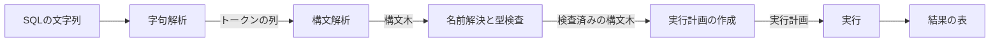

# Iteration 0：SQLの処理の流れと字句解析

## SQLの処理の流れ

データベースは，受け取ったSQLの文字列を次の段階で処理する．



| 段階 | すること | `ferrodb`で作るIteration |
| --- | --- | --- |
| 字句解析 | 文字の並びを，意味のある最小の単位(トークン)に分ける | 0 |
| 構文解析 | トークンの並びが文法に合うかを調べ，構文木を作る | 1 |
| 名前解決と型検査 | 表や列の名前が存在するか，型が合うかを調べる | 5，7 |
| 実行計画の作成 | どの順に，どの方法で行を読むかを決める | 10，17 |
| 実行 | 計画に従って行を読み書きし，結果を作る | 1から |

PostgreSQLなどのデータベースも，同じ流れでSQLを処理する．
Iteration 0では，最初の段階である字句解析を作る．

## トークン

標準SQLは，SQLの文を次のような種類のトークンの並びとして定める．

| 種類 | 例 |
| --- | --- |
| キーワード | `VALUES`，`SELECT`，`FROM` |
| 識別子 | 表の名前`emp`，列の名前`salary` |
| 数値リテラル | `42` |
| 文字列リテラル | `'abc'` |
| 区切り記号と演算子 | `(`，`)`，`,`，`+`，`*`，`<=` |

トークンの間には，区切り(空白，改行，コメント)を置ける．区切りは意味を持たないので，字句解析で読み飛ばす．

キーワードは大文字と小文字を区別しない．`VALUES`，`values`，`Values`はどれも同じキーワードである．

Iteration 0では，キーワード`VALUES`，数値リテラル，区切り記号と四則演算の演算子を扱う．
識別子はIteration 5，文字列リテラルはIteration 3で加える．

## 字句解析のエラー

どの種類のトークンにも当てはまらない文字があると，字句解析は失敗する．
利用者が誤りを直せるように，エラーには問題の位置を含める．
PostgreSQLは，エラーの位置を「文の先頭の文字を1と数えた番号」で返す．`ferrodb`もこれに合わせる．

## `VALUES`

`VALUES`は，標準SQLの表値構成子(table value constructor)である．
括弧で囲んだ値の並びが1行になり，全体で1つの表を作る．

```sql
VALUES (1, 2 + 3)
VALUES (1, 'a'), (2, 'b')
```

1つ目は1行2列，2つ目は2行2列の表になる．
表を1つも作らずに式を計算できるので，`ferrodb`はIteration 1〜4で`VALUES`を使って式の評価を作る．
