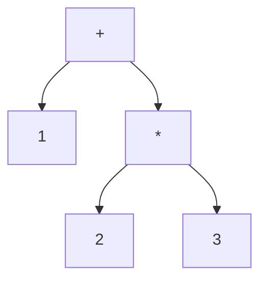

# Iteration 1：構文解析と式の評価

## 構文木

構文解析は，トークンの列を，文法の構造を表す木(構文木)にする．
`1 + 2 * 3`の構文木は次のようになる．掛け算が足し算より先に結び付くので，`2 * 3`が1つの部分木になる．



構文木ができれば，括弧や優先順位はもう考えなくてよい．葉から順に値を計算すれば式の値になる．

## 優先順位と結合性

標準SQLの文法は，数値の式を次のように定める(一部を簡単にしたもの)．

```text
<numeric value expression> ::= <term>
                             | <numeric value expression> + <term>
                             | <numeric value expression> - <term>
<term>                     ::= <factor>
                             | <term> * <factor>
                             | <term> / <factor>
<factor>                   ::= [ + | - ] <numeric primary>
<numeric primary>          ::= <literal> | ( <numeric value expression> )
```

この文法から，次のことが分かる．

- `*`と`/`は，`+`と`-`より強く結び付く(`<term>`が`<numeric value expression>`の部品になっている)．
- 単項の`-`は，`*`と`/`より強く結び付く(`<factor>`が`<term>`の部品になっている)．
- 同じ強さの演算子は，左から順に結び付く(左結合)．`1 - 2 - 3`は`(1 - 2) - 3`である．

`ferrodb`は，この優先順位を数値で表す(加減算10，乗除算20，単項の`-`30)．

## `INTEGER`型

標準SQLの`INTEGER`は，精度が実装に任された整数型である．PostgreSQLと`ferrodb`は32ビット符号付き整数(−2147483648〜2147483647)とする．

計算の結果が型の範囲に収まらないとき，標準SQLは「数値が範囲外である」という例外を起こすと定める．
0で割ったときも例外である．
Iteration 4では，これらの例外にSQLSTATEの番号を付けて返す．

整数どうしの割り算の結果の扱いは実装に任されている．PostgreSQLと`ferrodb`は，0の方向に切り捨てる．

```sql
VALUES (7 / 2, -7 / 2)   -- 3 と -3
```

## `VALUES`の列名

`VALUES`で作った表の列には，名前がない．列名の決め方は実装に任されている．
`ferrodb`は，左から`COLUMN1`，`COLUMN2`，…とする．
