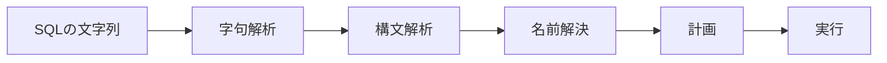

# Iteration 10：実行計画とVolcanoモデル

## 問い合わせの処理の段階

データベースは，SQLの文を次の段階で処理する．Iteration 10で，名前解決と実行の間に計画の段階が加わる．



- 名前解決(Iteration 7)は，名前を表と列に結び付ける．
- 計画は，名前を解決した問い合わせを，演算子の木(実行計画)にする．
- 実行は，実行計画の演算子を動かして結果の行を作る．

## 論理計画と物理計画

問い合わせの意味は，関係代数の演算の組み合わせで書ける．

| SQL | 関係代数の演算 | `ferrodb`の演算子 |
| --- | --- | --- |
| `FROM users` | 表そのもの | `SeqScan` |
| `WHERE id > 1` | 選択(σ) | `Filter` |
| `SELECT name` | 射影(π) | `Project` |
| `DISTINCT` | 重複の除去(δ) | `Distinct` |
| `ORDER BY name` | 並べ替え(τ) | `Sort` |

「何を計算するか」を演算の木で表したものを論理計画，「どの方法で計算するか」まで決めたものを物理計画と呼ぶ．
たとえば，表を読む方法には，すべての行を順に読む方法(シーケンシャルスキャン)と，インデックスを引く方法がある．
Iteration 17では，条件に合うインデックスがあれば，`SeqScan`の代わりに`IndexScan`を選ぶ．
`ferrodb`の`PlanNode`は，演算子の種類が1つずつしかないので，論理計画と物理計画を兼ねている．

## Volcanoモデル

実行計画の各演算子は，`next`を呼ばれるたびに1行を返し，行がなくなれば「終わり」を返す．
演算子は，親に`next`を呼ばれたときに，子の`next`を呼んで行を受け取る．
この方式をVolcanoモデル(イテレーターモデル)と呼ぶ．Graefeが1994年に発表したVolcanoという研究用のシステムに由来し，PostgreSQLも同じ方式で実行する．

```text
Sort [NAME]            ← 最上段の next を呼ぶと，
  Project [NAME]       ← 子の next を呼び，
    Filter (ID > 1)    ← 条件に合う行が来るまで子の next を呼び，
      SeqScan USERS    ← 表の行を1つ返す．
```

- 演算子は，子の種類を知らない．`next`という共通の操作だけでつながるので，演算子の組み合わせを自由に変えられる．
- `Filter`や`Project`は，1行を受け取るたびに1行を返す．結果の行を全部ためずに，上の演算子へ流せる(パイプライン)．
- `Sort`は，子の行をすべて読むまで1行目を返せない．このような演算子をブロッキング演算子と呼ぶ．
- `Limit`は，必要な行の数を返したら，子の`next`を呼ばない．下の演算子がパイプラインなら，表の残りの行を読まずに済む．

## `EXPLAIN`

`EXPLAIN`は，演算子を動かさずに実行計画だけを表示する．標準SQLにはなく，多くのデータベースが独自の形式で持つ．
`ferrodb`は，演算子を1行に1つ書き，子を親より2文字深く字下げする．

```text
 Sort [NAME]
   Project [NAME]
     Filter (ID > 1)
       SeqScan USERS
```

PostgreSQLの`EXPLAIN`は，各演算子の見積もりの費用と行の数も表示する．
PostgreSQLは，費用を比べて複数の実行計画から1つを選ぶ(費用に基づく最適化)．`ferrodb`は，決まった規則で1つの計画を作る．

## 結果の列にない並べ替えのキー

`SELECT name FROM users ORDER BY id`では，結果の列にない`id`で並べ替える．
`Sort`は子の`Project`が返す行しか見られないので，`Project`は`id`も隠れた列として計算する．
並べ替えたあと，最上段の`Project`が隠れた列を取り除く．

```text
 Project [NAME]
   Sort [ID]
     Project [NAME, ID]
       SeqScan USERS
```

PostgreSQLも，このような列を内部で計算し，結果から取り除く(resjunk列と呼ぶ)．
