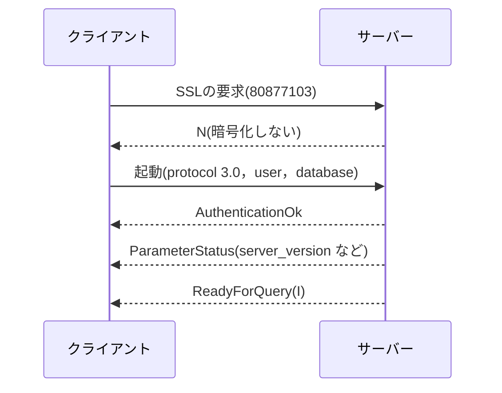
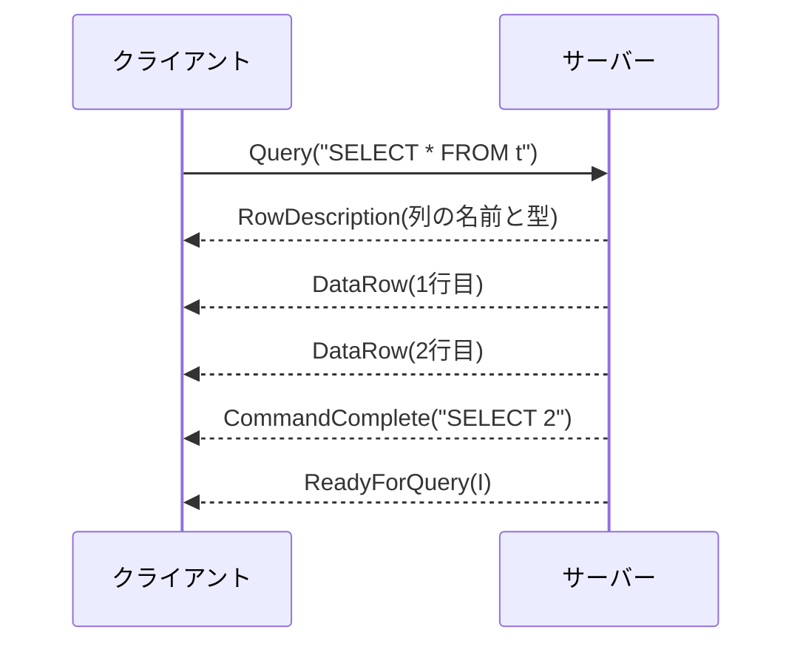

# Iteration 20：PostgreSQLのフロントエンド/バックエンドプロトコル

## クライアントとサーバー

これまでの`ferrodb`は，REPLかRustのプログラムから，同じプロセスの中で使った．
データベースの多くは，サーバーのプロセスとして動き，別のプロセスのクライアントとネットワークでつながる．クライアントとサーバーがやりとりするバイト列の決まりを，プロトコルという．

PostgreSQLのプロトコル(フロントエンド/バックエンドプロトコル)は，版3.0が2003年のPostgreSQL 7.4から使われている．
`ferrodb`がこのプロトコルを話せば，`psql`や，各言語のPostgreSQLのドライバー(Rustの`postgres`クレートなど)から，そのまま接続できる．フロントエンドはクライアント，バックエンドはサーバーのことである．

## メッセージ

やりとりは，メッセージの並びである．起動のあとのメッセージは，種類を表す1バイト(`Q`，`T`，`D`など)，長さの4バイト，内容からなる．

- 長さは，長さ自身の4バイトを含み，種類のバイトを含まない．内容のない`Terminate`の長さは4である．
- 数はビッグエンディアン(上位のバイトが先)で書く．ネットワークのプロトコルで広く使われる順序である．
- 文字列は，バイト列のあとに0のバイトを置く(C言語の文字列と同じ形)．

受け取る側は，種類と長さの5バイトを読めば，内容を最後まで読める．知らない種類のメッセージも読み飛ばせる．

## 起動と認証

接続した直後に，クライアントは起動のメッセージを送る．これだけは種類のバイトを持たず，長さのあとにプロトコルの番号(3.0なら196608)と，`user`や`database`などの名前と値の組を並べる．



- `psql`は，暗号化した接続を使えるかを先に尋ねる(SSLの要求)．サーバーは1バイトの`S`(使う)か`N`(使わない)で答える．`ferrodb`は`N`と答え，クライアントは同じ接続で暗号化せずに起動のメッセージを送る．
- 認証は，PostgreSQLではパスワードなどを求める`Authentication`のメッセージをやりとりする．`ferrodb`は何も求めず，すぐに`AuthenticationOk`を返す．
- `ParameterStatus`は，サーバーの設定をクライアントに知らせる．`psql`は`server_version`で使える機能を判断し，接続したときの表示に使う．`client_encoding`は文字列の符号化(`UTF8`)である．
- PostgreSQLは，実行中の問い合わせを別の接続から取り消すための鍵(`BackendKeyData`)も送る．`ferrodb`は，起動に`AuthenticationOk`，`ParameterStatus`，`ReadyForQuery`で答える．

## Simple Query

Simple Queryは，SQLの文字列を`Query`メッセージで送り，結果を受け取る方式である．



- 行を返す文は，`RowDescription`，行ごとの`DataRow`，`CommandComplete`を返す．行を返さない文は`CommandComplete`だけを返す．`CommandComplete`の文字列は，REPLに表示してきたコマンドタグ(Iteration 6)である．
- 空の問い合わせには`EmptyQueryResponse`を返す．
- 最後に必ず`ReadyForQuery`を返す．クライアントは，これを受け取るまで次の問い合わせを送らない．

1つの`Query`には，`;`で区切った複数の文を書ける．サーバーは順に実行し，文ごとに結果を返す．エラーになったら，残りの文は実行しない．
PostgreSQLは，複数の文を1つのトランザクションとして実行し，エラーになると前の文の変更も取り消す．`ferrodb`は，トランザクションの外では文ごとにコミットするので，エラーの前の文の変更は残る．

PostgreSQLには，文を準備(`Parse`)してから引数を結び付けて(`Bind`)実行する拡張クエリプロトコルもある．多くのドライバーは，引数のある問い合わせに拡張クエリプロトコルを使う．

## 型OIDとテキスト形式

`RowDescription`は，列ごとに名前と型を送る．型は，PostgreSQLのカタログ`pg_type`の番号(OID)で表す．

| 型 | OID | 大きさ |
| --- | --- | --- |
| `BOOLEAN`(`bool`) | 16 | 1 |
| `BIGINT`(`int8`) | 20 | 8 |
| `INTEGER`(`int4`) | 23 | 4 |
| `TEXT` | 25 | -1 |
| `VARCHAR` | 1043 | -1 |

- 大きさの-1は，値によって長さが変わる型を表す．
- `psql`は，型OIDで数の列かを判断し，数の列を右に寄せる．
- `ferrodb`の結果の表は列の型を持たないので，列の最初の`NULL`でない値の型で決める．値がすべて`NULL`の列は`TEXT`とする．

値は，テキスト形式(文字列)かバイナリ形式で送る．Simple Queryの結果はテキスト形式である．整数は10進数，真偽値は`t`と`f`である．
`NULL`は，値のバイト数を-1にして表す．空の文字列(バイト数0)とは区別される．

## エラー

エラーは`ErrorResponse`で返す．内容は，フィールドの種類の1バイトと文字列の組の並びで，最後に0のバイトを置く．

| 種類 | フィールド | 例 |
| --- | --- | --- |
| `S` | 重大度(利用者の言語) | `ERROR` |
| `V` | 重大度(英語のまま) | `ERROR` |
| `C` | SQLSTATE(Iteration 4) | `42601` |
| `M` | メッセージ | `syntax error at or near "FROM"` |
| `P` | エラーの位置(問い合わせの先頭の文字を1と数える) | `12` |

`psql`は，位置のフィールドがあれば，問い合わせの行を表示し，その位置に`^`を置く．

```text
ERROR:  syntax error at or near "FROM"
LINE 1: SELECT a + FROM t;
                   ^
```

位置は，1つの`Query`の文字列の先頭から数える．2つ目の文のエラーなら，1つ目の文とその`;`の文字の数を足す．

## トランザクションの状態

`ReadyForQuery`は，セッションのトランザクションの状態を1バイトで知らせる．

| バイト | 状態 | `psql`のプロンプト |
| --- | --- | --- |
| `I` | トランザクションの外 | `ferro=>` |
| `T` | トランザクションの中 | `ferro=*>` |
| `E` | 失敗したトランザクションの中(Iteration 18) | `ferro=!>` |

`psql`はこの状態をプロンプトに示す．`ferrodb`のREPLのプロンプト(Iteration 18)も，同じ記号を使ってきた．
