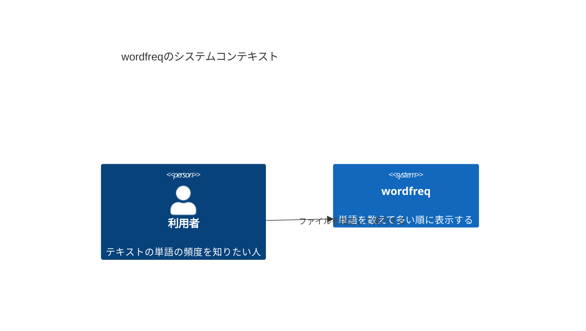
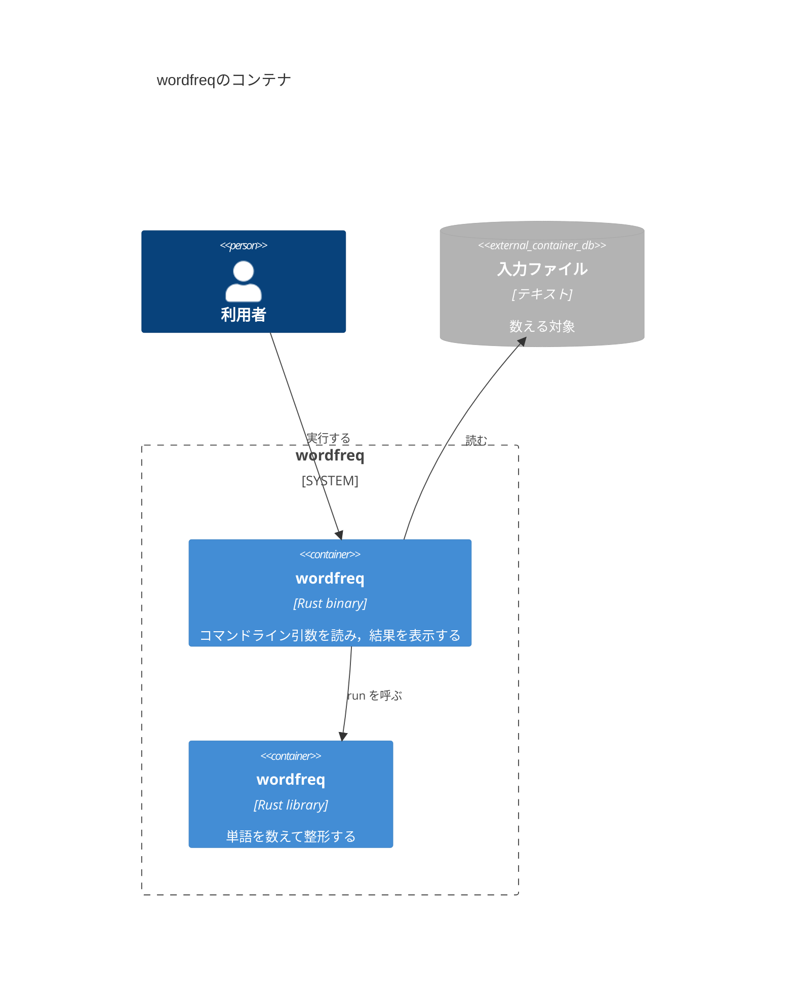
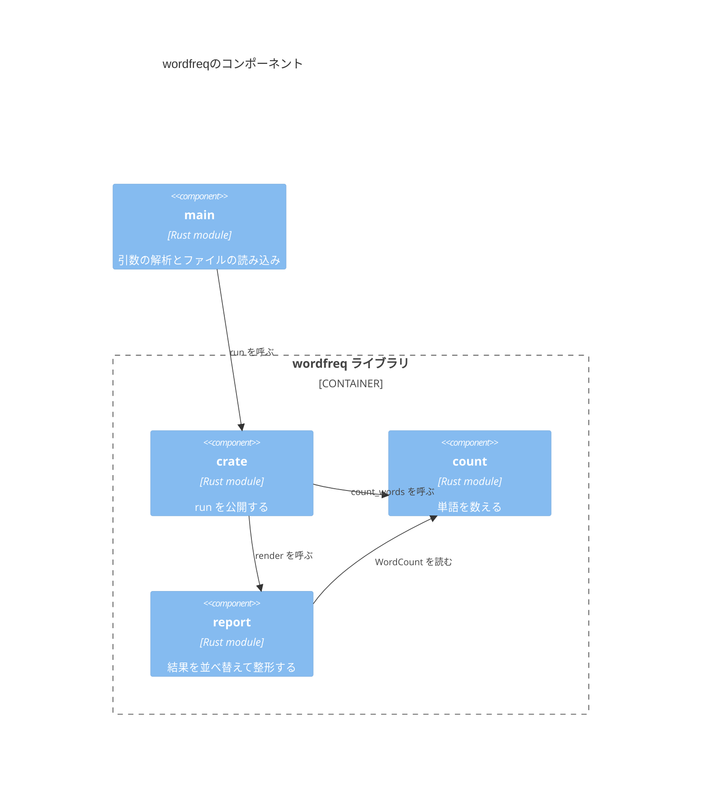
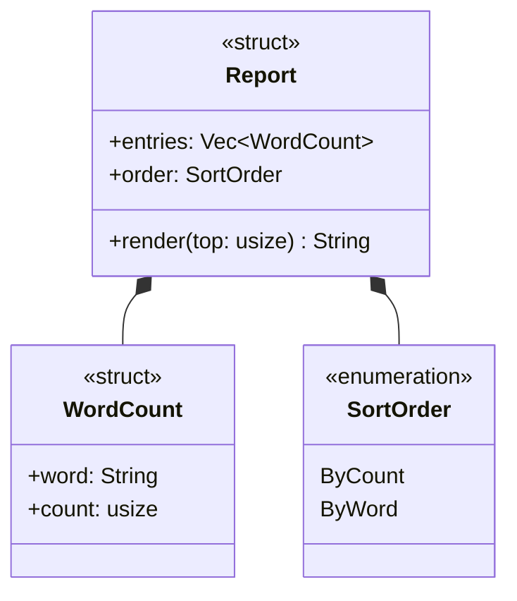
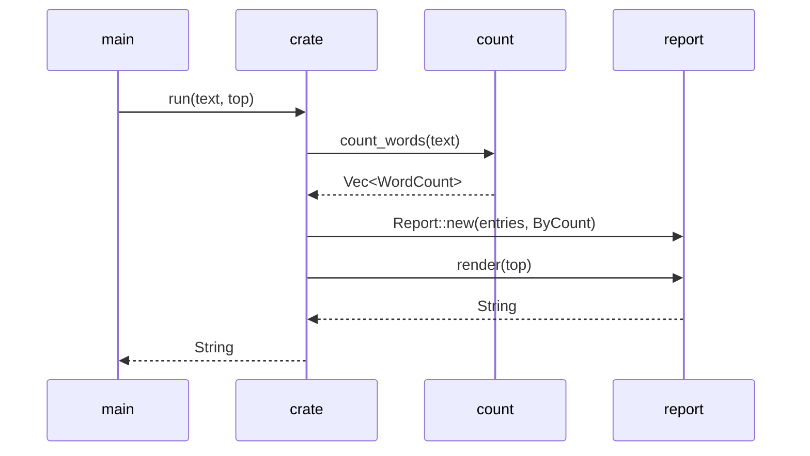
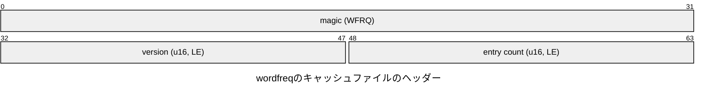

# 設計ドキュメントの書き方

各Iterationでは，テストリストを書いたあと実装の前に設計ドキュメントを更新し，実装のあとで実装と見比べる．

```text
テストリスト → 設計ドキュメント → テスト駆動の実装 → 設計レビュー
```

テストリストは，プログラムが外から見てどう振る舞うか(振る舞い)を書く．
設計ドキュメントは，その振る舞いをどんなモジュール，型，関数で実現するか(構造)を書く．
同じ機能を，テストリストは外側から，設計ドキュメントは内側から記述する．

## ドキュメントの一覧

設計ドキュメントは各パッケージの`design/`に置く．図はMarkdownの中にMermaidで描く．

| ファイル | 示すもの | 描く範囲 |
| --- | --- | --- |
| `c4-context.md` | `ferrodb`と，それを使う人やプログラム | システム全体を1つの箱として見る |
| `c4-container.md` | 実行されるもの(ライブラリ，プロセス)と保存されるもの(ファイル) | システムの中を，動く単位で分ける |
| `c4-component.md` | モジュールと，モジュールの間の依存 | ライブラリクレートの中を，モジュールの単位で分ける |
| `code-types.md` | 型(構造体，列挙型，トレイト)とその関係 | モジュールの中の型 |
| `code-sequence.md` | 主な処理での，関数の呼び出しの順序 | 1つの処理の流れ |
| `layout.md` | バイト列の配置 | ページやメッセージの中身(Iteration 13から) |

上の4つはC4モデルの4つの段階(Context，Container，Component，Code)に対応する．
Code段階は，型を示す`code-types.md`と処理の順序を示す`code-sequence.md`の2つに分ける．

## 例の題材

このガイドの例では，`ferrodb`とは別の小さなプログラム`wordfreq`を使う．
`wordfreq`は，テキストファイルの単語を数え，多い順に表示するコマンドである．

```console
$ wordfreq notes.txt --top 2
the 12
rust 7
```

`wordfreq`は次のモジュールからなる．

- `main`：コマンドライン引数を読み，ファイルを開いて`run`を呼ぶ．
- `crate`(`lib.rs`)：`run`関数．`count`と`report`を順に呼ぶ．
- `count`：単語を数える．`WordCount`型を持つ．
- `report`：数えた結果を並べ替えて文字列にする．`SortOrder`型を持つ．

## c4-context.md

システムを1つの箱として描き，それを使う人と外部のシステムを周りに置く．
矢印には，何のために使うかを書く．



## c4-container.md

システムの中を，実行される単位(プログラム，ライブラリ，サーバーのプロセス)と，保存される単位(ファイル，データベース)に分ける．
各箱には，技術(`Rust library`など)と役割を書く．



## c4-component.md

クレートの中のモジュールを`Component`で，モジュールの間の依存を`Rel`で描く．
この図は，`scripts/check-design.mjs`でコードと照合できるように，次の規約で書く．

- `Component(別名, "モジュールのパス", "Rust module", "役割")`と書く．パスは`crate::`を省き，`sql::lexer`のように書く．
- `lib.rs`のパスは`crate`，`main.rs`のパスは`main`とする．
- モジュールAのコードが，モジュールBの関数や型を参照していれば，`Rel(A, B, "何を使うか")`を描く．`use`，`crate::b::f()`のようなパス，`pub use`のどれでも依存になる．
- 矢印は，コードにある依存だけを，すべて描く．
- 外部のクレート(`winnow`など)は図に描かず，図の下の説明に書く．



- `main`は`std::env::args`で引数を読む．
- `count`は単語の区切りに`char::is_alphanumeric`を使う．

## code-types.md

型を`classDiagram`で描く．
型の種類はステレオタイプ(`<<struct>>`，`<<enumeration>>`，`<<trait>>`)で示し，フィールドとメソッドには型を書く．

| 関係 | 記法 | 使う場面 |
| --- | --- | --- |
| 所有(コンポジション) | `A *-- B` | AのフィールドがBを値として持つ(`Vec<B>`，`Box<B>`を含む) |
| 参照(関連) | `A --> B` | AのフィールドがBへの参照や`Rc<B>`を持つ |
| 実装 | `A ..\|> T` | AがトレイトTを実装する |
| 依存 | `A ..> B` | Aのメソッドの引数や戻り値がBを使う |



- `count`モジュールの`count_words(text: &str) -> Vec<WordCount>`が`WordCount`を作る．
- `SortOrder::ByCount`で同じ回数の単語は，単語の辞書順に並べる．

## code-sequence.md

1つの処理で，どの関数がどの順に呼ばれるかを`sequenceDiagram`で描く．
参加者はモジュール(または型)とし，矢印には関数名と主な引数を書く．
分岐は`alt`，繰り返しは`loop`で囲む．



## layout.md

ファイルやネットワークに書くバイト列の配置を，`packet`図で描く．
各行に`開始ビット-終了ビット: "フィールド名"`を書く．可変長の部分は，説明を下に書く．



- ヘッダーのあとに，単語の長さ(u8)，単語のバイト列(UTF-8)，回数(u32, LE)を繰り返す．

## 書き方の規則

- 図の中の名前(モジュール，型，関数，フィールド)は，コードの名前と一致させる．
- 1つの図には1つの視点だけを描く．Component図に型を描かず，型の図に呼び出しの順序を描かない．
- 図の上に，何を示す図かを1〜2文で書く．
- 図で表せない規則や細かいこと(補助関数の名前など)は，図の下に箇条書きで書く．
- 設計ドキュメントには，プログラムの現在の状態だけを書く．過去の形や将来の予定は書かない．

## 図の確認

VS CodeのMarkdownのプレビューでMermaidを表示するには，拡張機能「Markdown Preview Mermaid Support」を入れる．GitHubでは，そのまま図として表示される．

構文の検査は，演習のディレクトリで次のように実行する．

```console
$ node ../../../scripts/check-mermaid.mjs design/*.md
mermaid: 5 blocks, 0 errors
```

設計レビューでは，Component図と型の図をコードと照合できる．

```console
$ node ../../../scripts/check-design.mjs .
design: 1 packages, 0 problems
```

照合の結果に「Component図にない依存」が出たら，コードにある依存を図に描き足すか，コードの依存が設計の意図と合っているかを見直す．
