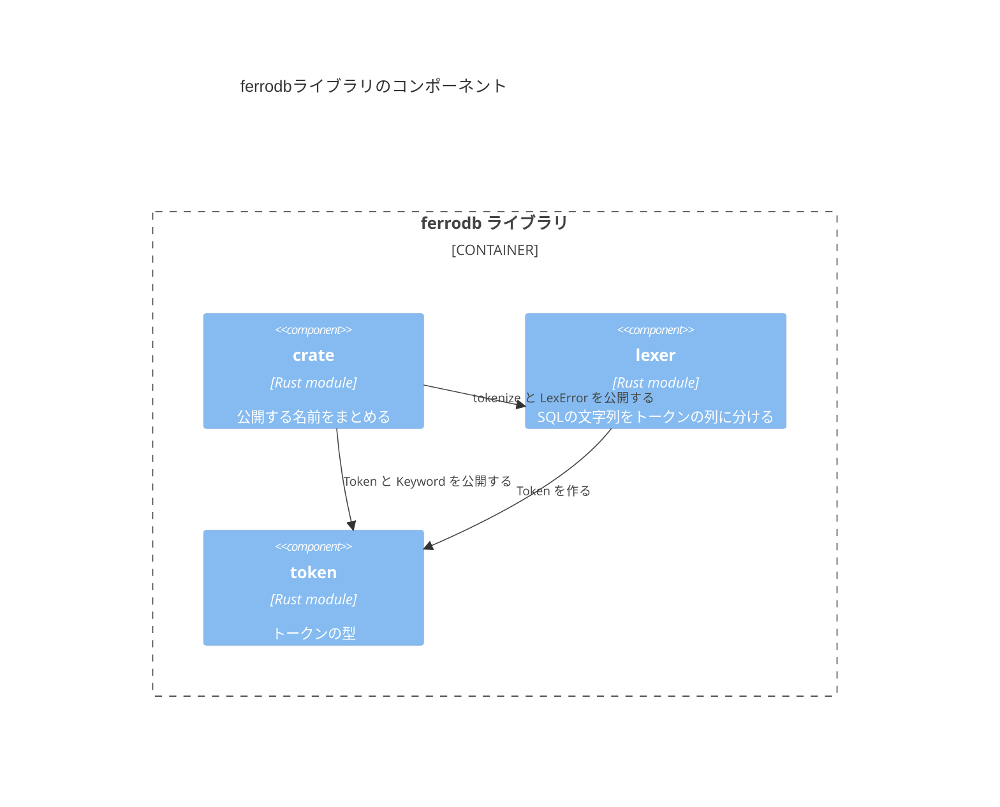

# コンポーネント

ライブラリクレート`ferrodb`のモジュールと，モジュールの間の依存を示す．

```mermaid
C4Component
  title ferrodbライブラリのコンポーネント
  Container_Boundary(library, "ferrodb ライブラリ") {
    Component(root, "crate", "Rust module", "公開する名前をまとめる")
    Component(lexer, "lexer", "Rust module", "SQLの文字列をトークンの列に分ける")
    Component(token, "token", "Rust module", "トークンの型")
  }
  Rel(root, lexer, "tokenize と LexError を公開する")
  Rel(root, token, "Token と Keyword を公開する")
  Rel(lexer, token, "Token を作る")
```

- `lexer`は，外部のクレート`winnow`のパーサーを組み合わせてトークンを読む．
- `lexer`と`token`は非公開のモジュールで，利用者は`crate`が`pub use`で公開する名前だけを使う．
