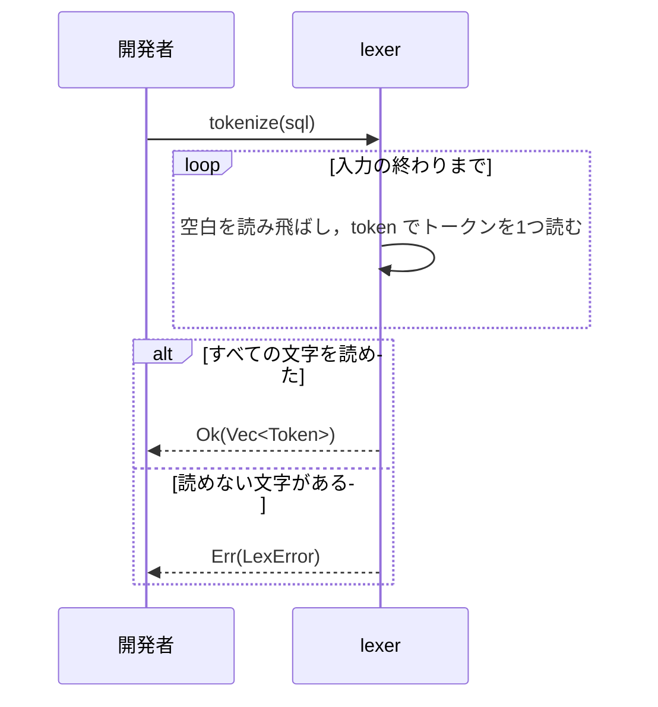

# 処理の流れ

`tokenize`がSQLの文字列をトークンの列に分ける流れを示す．

```mermaid
sequenceDiagram
  participant developer as 開発者
  participant lexer
  developer->>lexer: tokenize(sql)
  loop 入力の終わりまで
    lexer->>lexer: 空白を読み飛ばし，token でトークンを1つ読む
  end
  alt すべての文字を読めた
    lexer-->>developer: Ok(Vec<Token>)
  else 読めない文字がある
    lexer-->>developer: Err(LexError)
  end
```

- `token`は，`keyword`，`integer`，`symbol`の順に試し，最初に読めたものを返す．
- `keyword`は英字の並びを読み，`to_keyword`で`VALUES`かどうかを大文字と小文字を区別せずに判定する．
