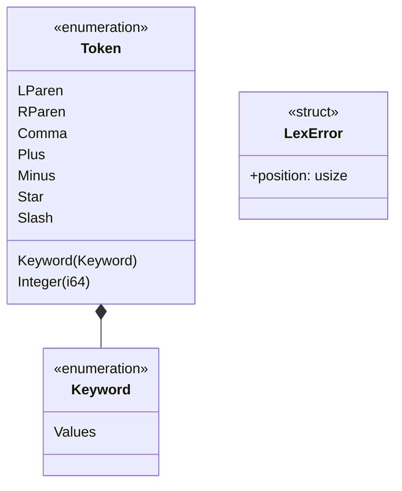

# 型

字句解析で使う型を示す．

- `lexer::tokenize(sql: &str) -> Result<Vec<Token>, LexError>`は，`Token`の列か`LexError`を返す．
- `LexError`の`position`は，解釈できなかった文字の位置である．先頭の文字を1と数える．
- `Token`と`Keyword`は，winnowの`value`で値を複製するために`Clone`を導出する．
