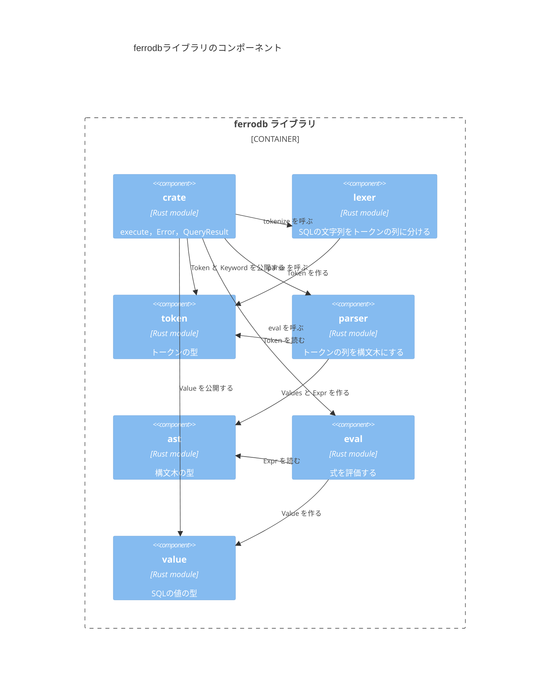

# コンポーネント

ライブラリクレート`ferrodb`のモジュールと，モジュールの間の依存を示す．
`crate`の`execute`が，字句解析，構文解析，評価を順に呼ぶ．

- `lexer`と`parser`は，外部のクレート`winnow`のパーサーを組み合わせる．
- `parser`と`eval`の単体テストは，入力を用意するために`lexer`と`parser`を使う．単体テストの依存は図に含めない．
