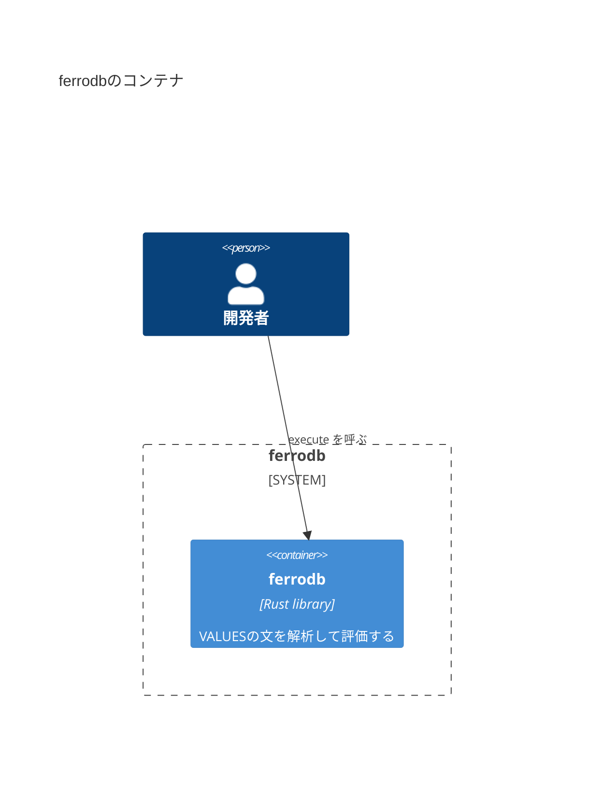

# コンテナ

`ferrodb`を構成する，実行される単位と保存される単位を示す．
現在はライブラリクレートが1つだけある．

```mermaid
C4Container
  title ferrodbのコンテナ
  Person(developer, "開発者")
  System_Boundary(system, "ferrodb") {
    Container(library, "ferrodb", "Rust library", "VALUESの文を解析して評価する")
  }
  Rel(developer, library, "execute を呼ぶ")
```
