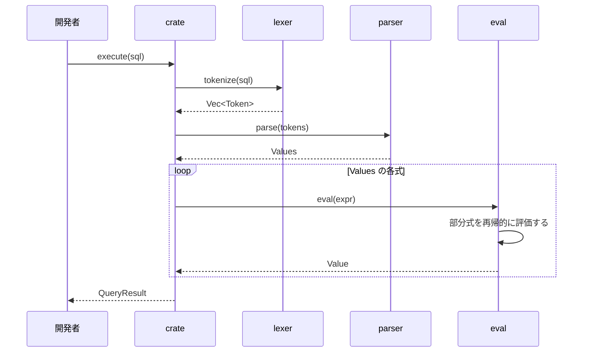

# 処理の流れ

`execute`が`VALUES`の文を実行する流れを示す．

- どの段階でエラーが起きても，`execute`はそこで止まり，段階に応じた`Error`の列挙子で包んで返す．
- `parser`は，`VALUES`，括弧，コンマで区切った式の並びを読む．式は，winnowの`expression`に優先順位(加減算10，乗除算20，単項の`-`30)を渡して読む．
- `eval`は，`i32`の検査付き演算(`checked_add`など)で計算し，範囲を超えたら`NumericOutOfRange`，0での割り算は`DivisionByZero`を返す．
