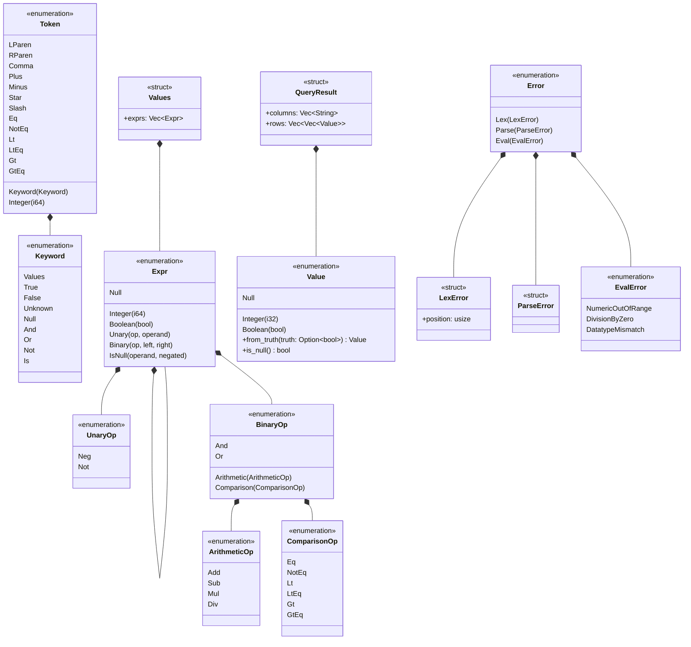

# 型

トークン，構文木，値，エラー，結果の型を示す．
構文木`Expr`は，自分自身を`Box`で持つ再帰的な直和型である．

- `Expr::Unary`のフィールドは`op: UnaryOp`，`operand: Box<Expr>`である．
- `Expr::Binary`のフィールドは`op: BinaryOp`，`left: Box<Expr>`，`right: Box<Expr>`である．
- `Expr::IsNull`のフィールドは`operand: Box<Expr>`，`negated: bool`である．`negated`が`true`なら`IS NOT NULL`を表す．
- `BinaryOp`は演算子を種類ごとの型に分ける．算術演算を評価する関数は`ArithmeticOp`だけを受け取る．
- `Value::Null`は，型によらず値がないことを表す．真偽値の`UNKNOWN`も`Value::Null`になる．
- `ParseError`はフィールドを持たない構造体である．
- `Error`の列挙子は，どの段階で失敗したかを表し，その段階のエラーを持つ．
- 各段階の関数のシグネチャは次のとおりである．
  - `lexer::tokenize(sql: &str) -> Result<Vec<Token>, LexError>`
  - `parser::parse(tokens: &[Token]) -> Result<Values, ParseError>`
  - `eval::eval(expr: &Expr) -> Result<Value, EvalError>`
  - `execute(sql: &str) -> Result<QueryResult, Error>`
