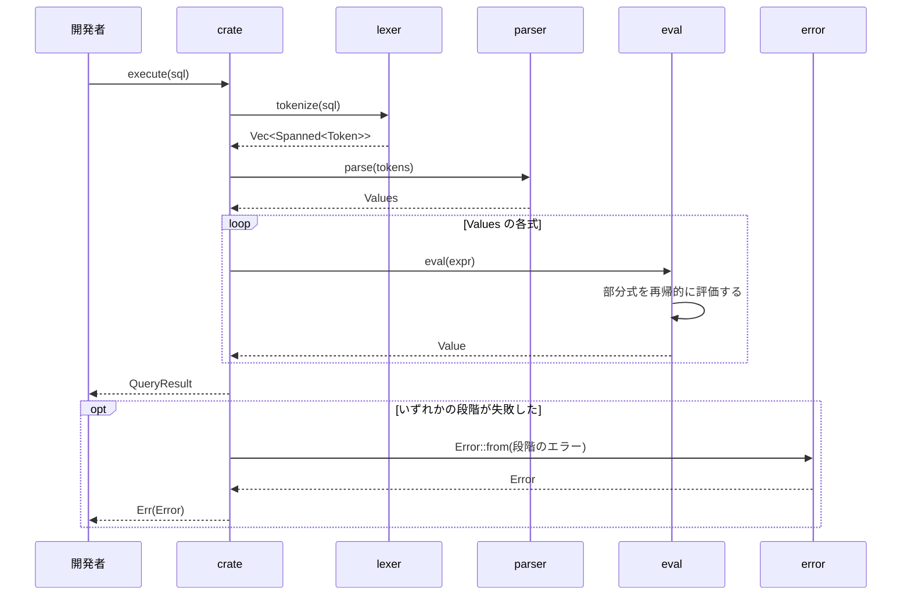

# 処理の流れ

`execute`が`VALUES`の文を実行する流れを示す．

- どの段階でエラーが起きても，`execute`はそこで止まる．`?`が`From`の実装で段階のエラーを`Error`に変換して返す．
- `lexer`は，各トークンのバイトの範囲を`with_span`で得て，文字の位置に直して`Spanned`に入れる．
- `parser`は，括弧のあと，`,`のあと，`VALUES (`のあとの式を`cut_err`で読む．そこで失敗すると，バックトラックせずに，誤りのあるトークンの位置でエラーになる．
- `parser`は，`VALUES`，括弧，コンマで区切った式の並びを読む．式は，winnowの`expression`に次の優先順位を渡して読む．
  - `OR`：1，`AND`：2，`NOT`：3，`IS [NOT] NULL`：4，比較：5(結合性なし)，連結`||`：7，加減算：10，乗除算：20，単項の`-`：30
- `eval`は，`AND`，`OR`，`NOT`の両辺を`Option<bool>`(`None`が不明)に変換し，3値論理の真理値表で計算する．
- `eval`は，連結では左辺の`String`の末尾に右辺を足して返す．
- `eval`は，算術演算，比較，連結の片方が`NULL`なら`NULL`を返す．型が合わなければ`DatatypeMismatch`を返す．
- `eval`は，整数を`i32`の検査付き演算(`checked_add`など)で計算し，範囲を超えたら`NumericOutOfRange`，0での割り算は`DivisionByZero`を返す．
