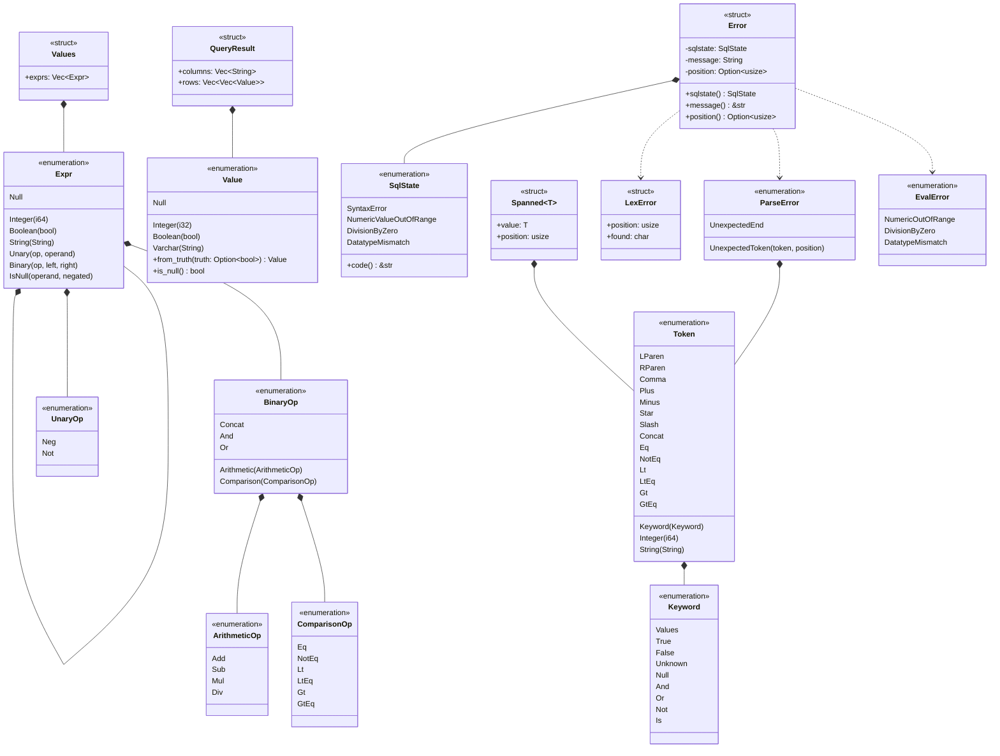

# 型

トークン，構文木，値，エラー，結果の型を示す．
構文木`Expr`は，自分自身を`Box`で持つ再帰的な直和型である．

- `Expr::Unary`のフィールドは`op: UnaryOp`，`operand: Box<Expr>`である．
- `Expr::Binary`のフィールドは`op: BinaryOp`，`left: Box<Expr>`，`right: Box<Expr>`である．
- `Expr::IsNull`のフィールドは`operand: Box<Expr>`，`negated: bool`である．`negated`が`true`なら`IS NOT NULL`を表す．
- `BinaryOp`は演算子を種類ごとの型に分ける．算術演算を評価する関数は`ArithmeticOp`だけを受け取る．
- `Token::String`，`Expr::String`，`Value::Varchar`は，それぞれ文字列を所有する．構文解析器は`&Token`の文字列を`clone`して`Expr::String`を作る．
- `Value::Null`は，型によらず値がないことを表す．真偽値の`UNKNOWN`も`Value::Null`になる．
- `ParseError::UnexpectedToken`は，読めなかったトークンと，その文字の位置を持つ．`UnexpectedEnd`は文が途中で終わったことを表し，位置を持たない．
- `Error`は，どの段階のエラーもSQLSTATE，メッセージ，位置の組で表す．フィールドは非公開で，同じ名前のメソッドで読む．
- `Error`は`From<LexError>`，`From<ParseError>`，`From<EvalError>`を実装する．`?`はこの変換を使う．
- `Spanned<Token>`は`PartialEq<Token>`を実装し，winnowの`literal(Token::Comma)`で比べられる．
- 各段階の関数のシグネチャは次のとおりである．
  - `lexer::tokenize(sql: &str) -> Result<Vec<Spanned<Token>>, LexError>`
  - `parser::parse(tokens: &[Spanned<Token>]) -> Result<Values, ParseError>`
  - `eval::eval(expr: &Expr) -> Result<Value, EvalError>`
  - `execute(sql: &str) -> Result<QueryResult, Error>`
