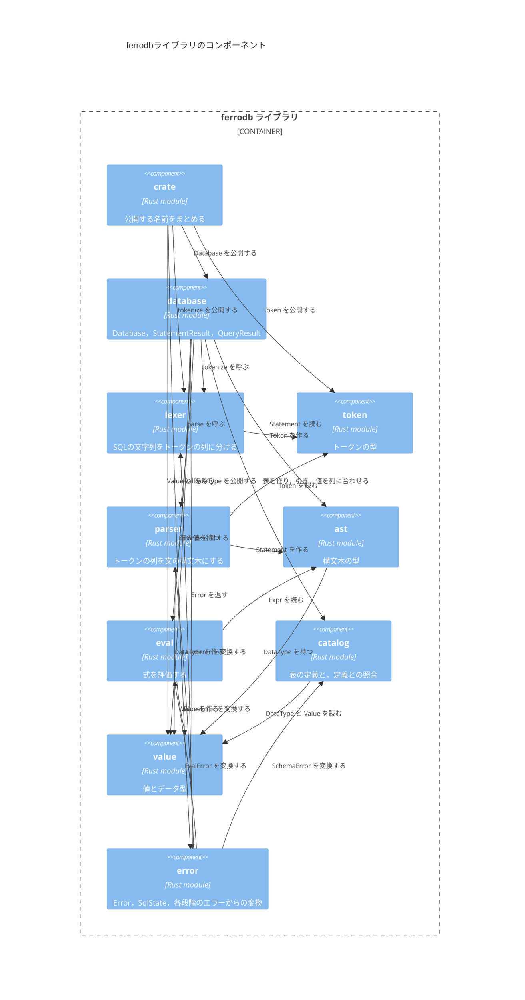

# コンポーネント

ライブラリクレート`ferrodb`のモジュールと，モジュールの間の依存を示す．
`database`の`Database::execute`が入口で，字句解析，構文解析のあと，文の種類ごとに評価，カタログとの照合，行を読み書きする．

- 表の定義は`catalog`の`Catalog`が，表の行は`Database`が持つ．定義と行を分けておくと，行の置き場所を変えても定義の扱いは変わらない．
- `lexer`と`parser`は，外部のクレート`winnow`のパーサーを組み合わせる．
- 単体テストの依存は図に含めない．
