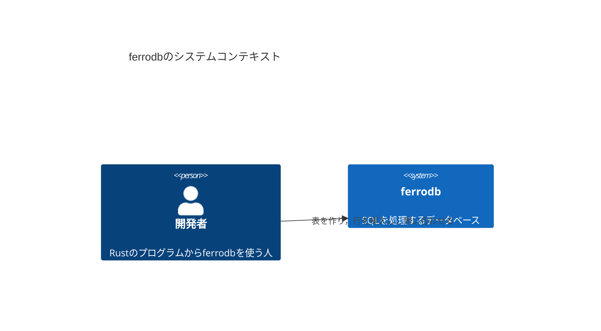

# システムコンテキスト

`ferrodb`と，それを使う人の関係を示す．
`ferrodb`は，Rustのプログラムから呼び出すライブラリである．

```mermaid
C4Context
  title ferrodbのシステムコンテキスト
  Person(developer, "開発者", "Rustのプログラムからferrodbを使う人")
  System(ferrodb, "ferrodb", "SQLを処理するデータベース")
  Rel(developer, ferrodb, "表を作り，行を挿入し，問い合わせる")
```
