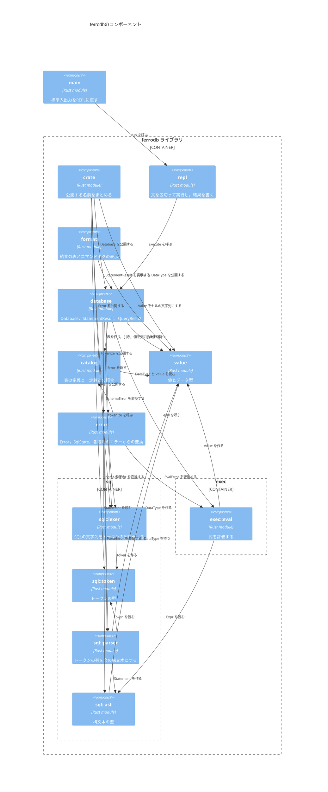

# コンポーネント

`ferrodb`のモジュールと，モジュールの間の依存を示す．
`main`がREPLを起動し，`repl`は文を`database`で実行して，結果を`format`の表示で書く．

- `sql`と`exec`は，子モジュールを宣言するだけのモジュールなので，境界として描いた．
- `repl`は`format`の関数を直接呼ばない．`format`が`StatementResult`に`Display`を実装するので，`repl`は`{}`で書くだけである．
- `lexer`と`parser`は，外部のクレート`winnow`のパーサーを組み合わせる．
- 単体テストの依存は図に含めない．
