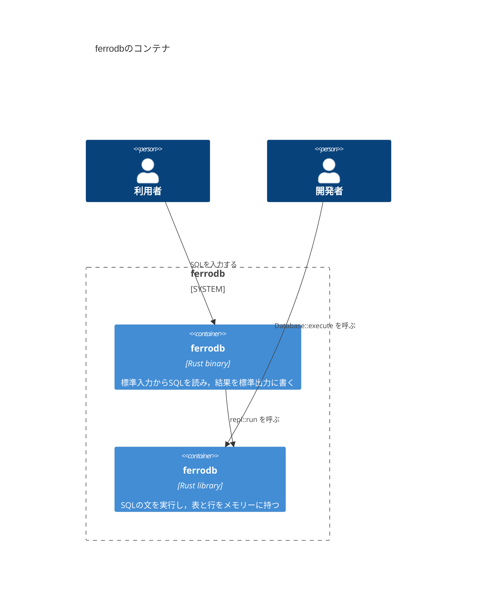

# コンテナ

`ferrodb`を構成する，実行される単位と保存される単位を示す．
REPLのバイナリは，ライブラリの`repl::run`に標準入出力を渡す．

```mermaid
C4Container
  title ferrodbのコンテナ
  Person(user, "利用者")
  Person(developer, "開発者")
  System_Boundary(system, "ferrodb") {
    Container(repl, "ferrodb", "Rust binary", "標準入力からSQLを読み，結果を標準出力に書く")
    Container(library, "ferrodb", "Rust library", "SQLの文を実行し，表と行をメモリーに持つ")
  }
  Rel(user, repl, "SQLを入力する")
  Rel(repl, library, "repl::run を呼ぶ")
  Rel(developer, library, "Database::execute を呼ぶ")
```

- 表と行はプロセスのメモリーにあるので，REPLを終了すると消える．
