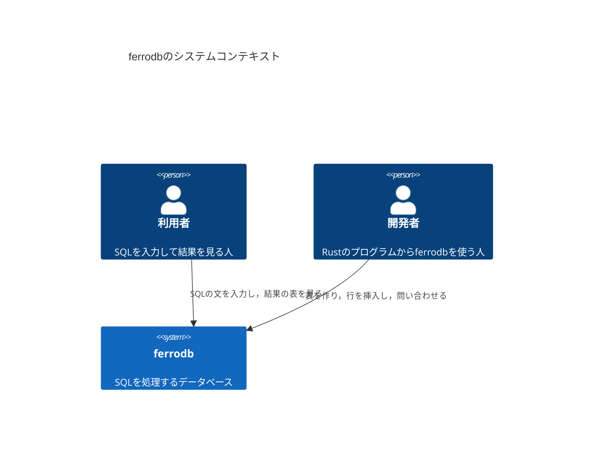

# システムコンテキスト

`ferrodb`と，それを使う人の関係を示す．
利用者はREPLでSQLを対話的に実行し，開発者はRustのプログラムからライブラリとして使う．

```mermaid
C4Context
  title ferrodbのシステムコンテキスト
  Person(user, "利用者", "SQLを入力して結果を見る人")
  Person(developer, "開発者", "Rustのプログラムからferrodbを使う人")
  System(ferrodb, "ferrodb", "SQLを処理するデータベース")
  Rel(user, ferrodb, "SQLの文を入力し，結果の表を見る")
  Rel(developer, ferrodb, "表を作り，行を挿入し，問い合わせる")
```
