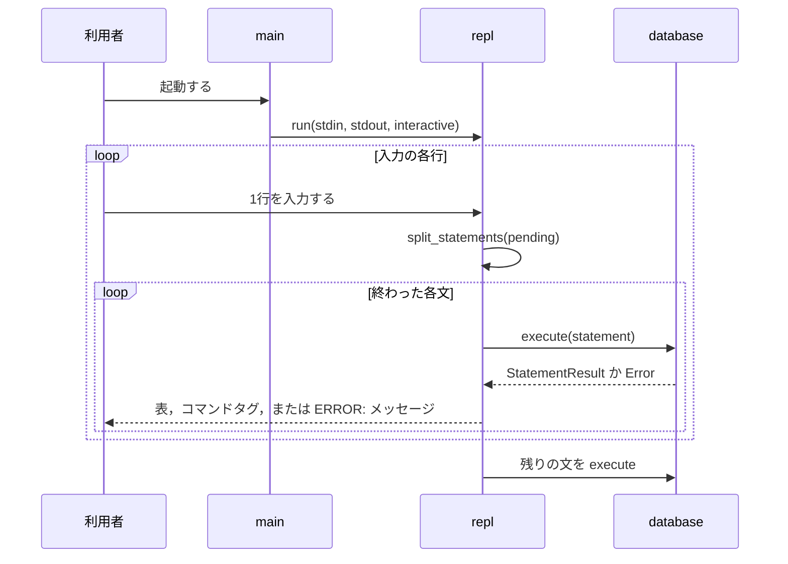
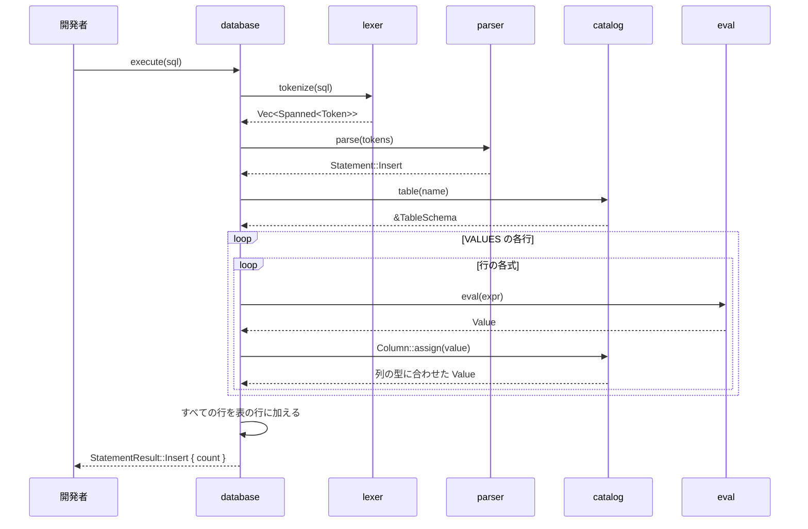

# 処理の流れ

## REPL

REPLが行を読み，`;`で終わった文を実行して結果を書く流れを示す．

- `split_statements`は，引用符の外の`;`で文を区切る．区切った文と，まだ終わっていない残りを返す．
- `interactive`が真なら，文の途中かどうかでプロンプト`ferrodb>`か`->`を書く．どちらも9文字の幅で，最後に空白を1つ置く．
- 問い合わせの結果の表のあとには空行を書く．

## INSERT

`Database::execute`が`INSERT`を実行する流れを示す．ほかの文も，構文解析までは同じである．

- どの段階でエラーが起きても，`execute`はそこで止まり，`?`が`From`の実装で段階のエラーを`Error`に変換して返す．
- `INSERT`は，すべての行を評価し，列に合わせ終えてから表の行に加える．途中でエラーになれば，1行も加えない．
- `CREATE TABLE`は`Catalog::create_table`で定義を加え，空の行の並びを用意する．`SELECT * FROM`は定義から列名を，行の並びから行を複製して返す．`VALUES`は各行の式を評価して表を作る．
- `lexer`は，引用符で囲まない識別子を大文字にし，`"`で囲んだ識別子はそのまま残す．
- `parser`は，`VALUES`の行によって値の数が違えば`ValuesLengthMismatch`を返す．式の優先順位は次のとおりである．
  - `OR`：1，`AND`：2，`NOT`：3，`IS [NOT] NULL`：4，比較：5(結合性なし)，連結`||`：7，加減算：10，乗除算：20，単項の`-`：30
- `eval`は，整数を`i64`で計算し，両辺が`INTEGER`なら結果を`INTEGER`の範囲に収める．片方が`BIGINT`なら結果は`BIGINT`である．
