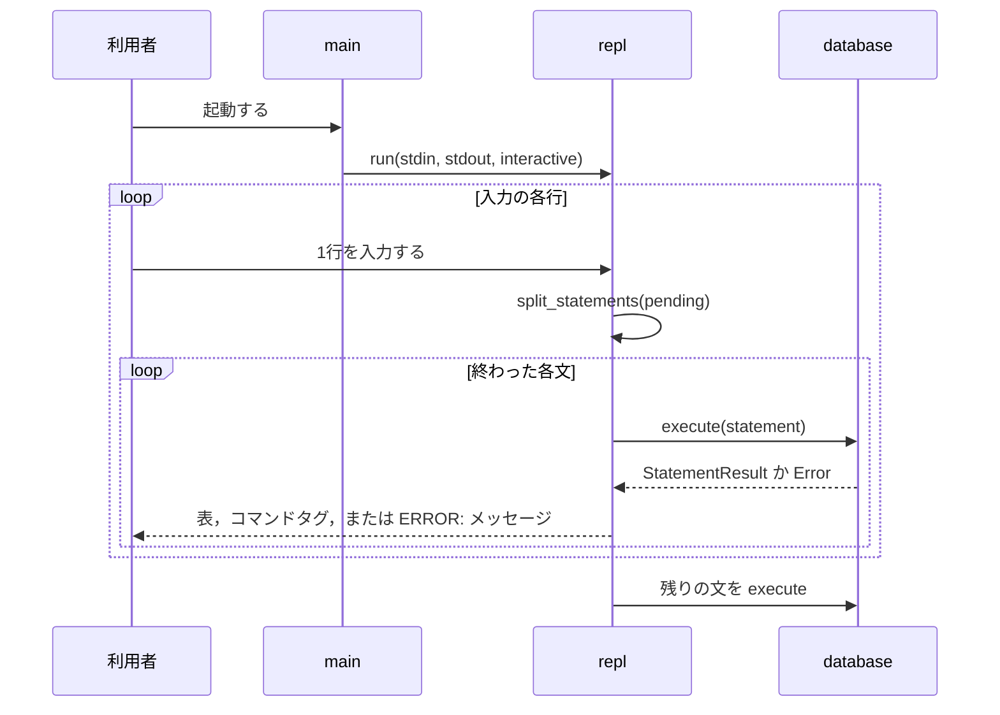
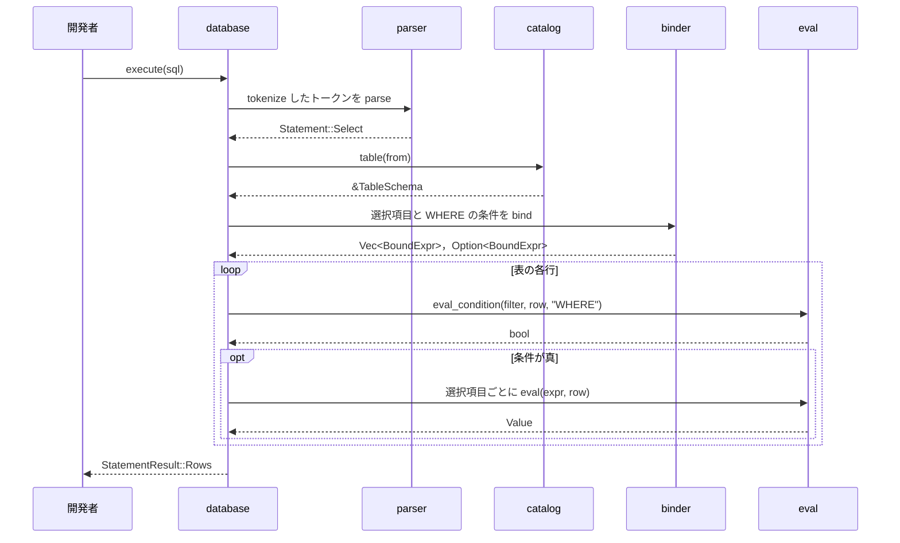

# 処理の流れ

## REPL

REPLが行を読み，`;`で終わった文を実行して結果を書く流れを示す．

- `split_statements`は，引用符の外の`;`で文を区切る．区切った文と，まだ終わっていない残りを返す．
- `interactive`が真なら，文の途中かどうかでプロンプト`ferrodb>`か`->`を書く．どちらも9文字の幅で，最後に空白を1つ置く．
- 問い合わせの結果の表のあとには空行を書く．

## SELECT

`Database::execute`が`SELECT`を実行する流れを示す．

- どの段階でエラーが起きても，`execute`はそこで止まり，`?`が`From`の実装で段階のエラーを`Error`に変換して返す．
- `*`は，表のすべての列を指す`BoundExpr::Column`に展開する．
- 結果の列名は，別名，列の名前，`?column?`の順に決める．
- `WHERE`の条件が偽か`NULL`の行は結果に含めない．真偽値でなければ`ArgumentNotBoolean`になる．
- `INSERT`は，すべての行を評価し，`Column::assign`で列の型に合わせ終えてから表の行に加える．途中でエラーになれば，1行も加えない．
- `VALUES`と`INSERT`の式は，列のない空の行について評価する．列を参照すると名前解決で`UndefinedColumn`になる．
- 式の優先順位は次のとおりである．
  - `OR`：1，`AND`：2，`NOT`：3，`IS [NOT] NULL`：4，比較：5(結合性なし)，連結`||`：7，加減算：10，乗除算：20，単項の`-`：30
