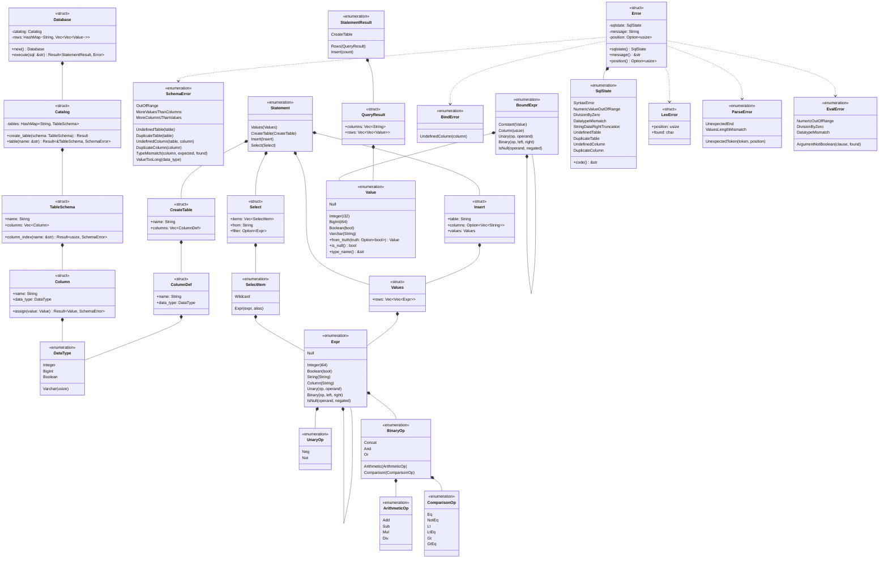

# 型

データベース，カタログ，構文木，値，エラー，結果の型を示す．トークンの型(`Token`，`Keyword`，`Spanned`)は，この図では省く．
構文木`Expr`は，自分自身を`Box`で持つ再帰的な直和型である．

- `Expr::Unary`のフィールドは`op: UnaryOp`，`operand: Box<Expr>`である．
- `Expr::Binary`のフィールドは`op: BinaryOp`，`left: Box<Expr>`，`right: Box<Expr>`である．
- `Expr::IsNull`のフィールドは`operand: Box<Expr>`，`negated: bool`である．`negated`が`true`なら`IS NOT NULL`を表す．
- `BinaryOp`は演算子を種類ごとの型に分ける．算術演算を評価する関数は`ArithmeticOp`だけを受け取る．
- `Value::Null`は，型によらず値がないことを表す．真偽値の`UNKNOWN`も`Value::Null`になる．
- `ParseError::UnexpectedToken`は，読めなかったトークンと，その文字の位置を持つ．`UnexpectedEnd`は文が途中で終わったことを表し，位置を持たない．
- `Error`は，どの段階のエラーもSQLSTATE，メッセージ，位置の組で表す．フィールドは非公開で，同じ名前のメソッドで読む．
- `Error`は`From<LexError>`，`From<ParseError>`，`From<EvalError>`を実装する．`?`はこの変換を使う．
- `StatementResult`と`QueryResult`は`Display`を実装する(`format`モジュール)．問い合わせの結果は表に，`CREATE TABLE`と`INSERT`はコマンドタグ(`CREATE TABLE`，`INSERT 0 2`)になる．
- `plan::binder::bind`は，`Expr`の列の名前を`&[Column]`の中の番号に解決し，リテラルを値にして`BoundExpr`を作る．`exec::eval::eval`は`BoundExpr`と行`&[Value]`から値を計算する．列の名前が残った式は評価できない．
- `Select::filter`は`WHERE`の条件で，書かなければ`None`である．
- `Database`は，表の定義を`Catalog`に，表の行を表の名前ごとの`Vec<Vec<Value>>`に持つ．
- `Insert::columns`が`None`なら，すべての列に定義の順で値を入れる．
- `Column::assign`は，値を列の型に合わせる．`INTEGER`と`BIGINT`は範囲に収まれば互いに変換し，`VARCHAR(n)`は文字の数を調べる．型が合わなければ`SchemaError`を返す．
- `SchemaError`の各列挙子は，メッセージに必要な情報を持つ．`Error`への変換で，SQLSTATEとメッセージになる．
