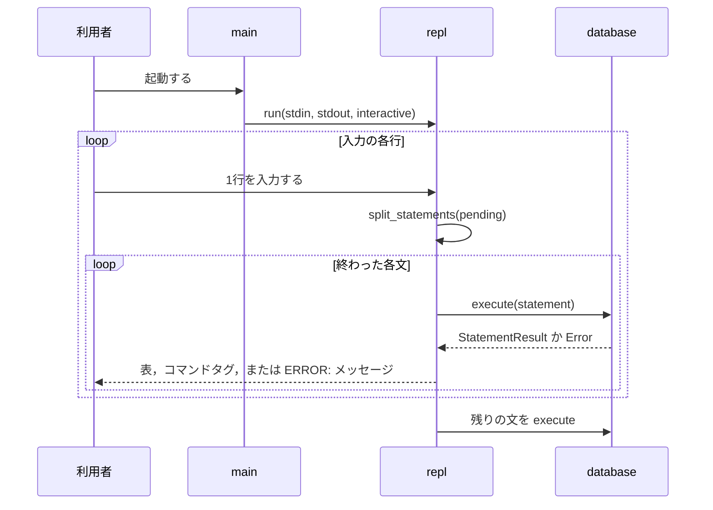
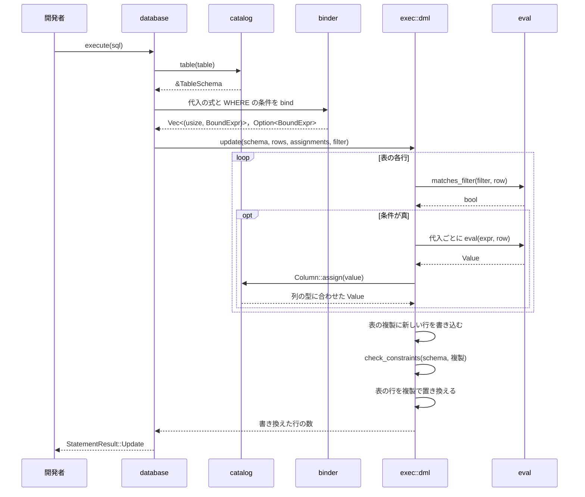

# 処理の流れ

## REPL

REPLが行を読み，`;`で終わった文を実行して結果を書く流れを示す．

- `split_statements`は，引用符の外の`;`で文を区切る．区切った文と，まだ終わっていない残りを返す．
- `interactive`が真なら，文の途中かどうかでプロンプト`ferrodb>`か`->`を書く．どちらも9文字の幅で，最後に空白を1つ置く．
- 問い合わせの結果の表のあとには空行を書く．

## SELECT

`Database::execute`が`SELECT`を実行する流れを示す．名前を解決し，実行計画を作り，演算子の木で実行する．
図の実行計画は`SELECT name FROM users WHERE id > 1 ORDER BY name`のものである．

```mermaid
sequenceDiagram
  participant developer as 開発者
  participant database
  participant binder
  participant planner
  participant build as exec::build
  participant sort as Sort
  participant project as Project
  participant filter as Filter
  participant scan as SeqScan
  developer->>database: execute(sql)
  database->>binder: bind_select(select, schema)
  binder-->>database: BoundSelect
  database->>planner: plan(bound)
  planner-->>database: PlanNode
  database->>build: build(plan, rows)
  build-->>database: Box<dyn Executor>
  database->>sort: next()
  loop 子の行がなくなるまで
    sort->>project: next()
    project->>filter: next()
    loop 条件が真の行が見つかるまで
      filter->>scan: next()
      scan-->>filter: Some(row)
    end
    filter-->>project: Some(row)
    project-->>sort: Some(選択項目の値)
  end
  sort->>sort: キーの値で並べ替える
  sort-->>database: Some(1行目)
  loop 行がなくなるまで
    database->>sort: next()
    sort-->>database: Some(row) か None
  end
  database-->>developer: StatementResult::Rows
```

- 演算子は，親に`next`を呼ばれたときに，子の`next`を呼んで1行ずつ受け取る(Volcanoモデル)．`SeqScan`は行がなくなると`None`を返し，`None`は親へ順に伝わる．
- `Sort`は，最初の`next`で子の行をすべて読んで並べ替える．それ以外の演算子は，1行を受け取るたびに1行を返す．
- 実行計画の演算子は，下から`SeqScan`，`Filter`(`WHERE`があるとき)，`Project`，`Distinct`，`Sort`，`Limit`の順に重ねる．`Filter`，`Distinct`，`Sort`，`Limit`は，その句がなければ置かない．
- 結果の列にない式で並べ替えるときは，下の`Project`がその式を隠れた列として計算し，最上段の`Project`が取り除く．
- `ORDER BY`の名前だけのキーは，まず結果の列名(別名を含む)から探し，なければ表の列として解決する．選択項目と同じ式のキーは，結果の列の値を使う．
- `EXPLAIN`は，同じ実行計画を`plan::explain`で行の並びにして返す．演算子は実行しない．
- `Filter`は，条件が偽か`NULL`の行を返さない．条件が真偽値でなければ`ArgumentNotBoolean`になる．
- `Distinct`は`NULL`どうしを同じ値とみなす．`DISTINCT`では，結果の列から値を取れないキーは`OrderByNotInSelectList`になる．
- 並べ替えは安定である．すべてのキーが等しい行は，子の演算子が返した順序を保つ．
- どの段階でエラーが起きても，`execute`はそこで止まり，`?`が`From`の実装で段階のエラーを`Error`に変換して返す．
- `*`は，表のすべての列を指す`BoundExpr::Column`に展開する．
- 結果の列名は，別名，列の名前，`?column?`の順に決める．
- `VALUES`と`INSERT`の式は，列のない空の行について評価する．列を参照すると名前解決で`UndefinedColumn`になる．
- 式の優先順位は次のとおりである．
  - `OR`：1，`AND`：2，`NOT`：3，`IS [NOT] NULL`：4，比較：5(結合性なし)，連結`||`：7，加減算：10，乗除算：20，単項の`-`：30

## UPDATE

`Database::execute`が`UPDATE`を実行する流れを示す．新しい行をすべて計算し，制約を検査してから表の行を置き換える．

- 代入の式は，すべて書き換える前の行で評価する．`SET a = b, b = a`は2つの列の値を入れ替える．
- 評価，型の変換，制約の検査のどこでエラーになっても，表の行を置き換える前に止まるので，表は変わらない．
- 制約は，すべての行を書き換えたあとの表で検査する．`SET id = id + 1`は，書き換えの途中で値が重なっても，終わったときに一意なら成功する．
- `INSERT`も，加える行をすべて評価し，`Column::assign`で列の型に合わせてから`exec::dml::insert`に渡す．`insert`は表の複製に行を加えて制約を検査し，表の行を置き換える．
- `DELETE`は，先にすべての行の条件を評価し，途中でエラーにならなければ`retain`で行を消す．
