# 型

データベース，カタログ，構文木，値，エラー，結果の型と，`SELECT`の名前解決，実行計画，演算子の型を示す．トークンの型(`Token`，`Keyword`，`Spanned`)は，この図では省く．
構文木`Expr`は，自分自身を`Box`で持つ再帰的な直和型である．

## データベースと構文木

```mermaid
classDiagram
  class Database {
    <<struct>>
    -catalog: Catalog
    -rows: HashMap~String, Vec~Row~~
    +new() Database
    +execute(sql: &str) Result~StatementResult, Error~
  }
  class StatementResult {
    <<enumeration>>
    Rows(QueryResult)
    CreateTable
    Insert(count)
    Update(count)
    Delete(count)
    DropTable
  }
  class Catalog {
    <<struct>>
    -tables: HashMap~String, TableSchema~
    +create_table(schema: TableSchema) Result
    +drop_table(name: &str) Result
    +table(name: &str) Result~&TableSchema, SchemaError~
  }
  class TableSchema {
    <<struct>>
    +name: String
    +columns: Vec~Column~
    +unique_constraints: Vec~UniqueConstraint~
    +column_index(name: &str) Result~usize, SchemaError~
  }
  class Column {
    <<struct>>
    +name: String
    +data_type: DataType
    +nullable: bool
    +assign(value: Value) Result~Value, SchemaError~
  }
  class UniqueConstraint {
    <<struct>>
    +name: String
    +column: usize
  }
  class ConstraintError {
    <<enumeration>>
    NotNull(table, column)
    Unique(constraint)
  }
  class DataType {
    <<enumeration>>
    Integer
    BigInt
    Boolean
    Varchar(usize)
  }
  class SchemaError {
    <<enumeration>>
    UndefinedTable(table)
    DuplicateTable(table)
    UndefinedColumn(table, column)
    DuplicateColumn(column)
    MultiplePrimaryKeys(table)
    UndefinedTableToDrop(table)
    DuplicateAssignment(column)
    TypeMismatch(column, expected, found)
    ValueTooLong(data_type)
    OutOfRange
    MoreValuesThanColumns
    MoreColumnsThanValues
  }
  class Statement {
    <<enumeration>>
    Values(Values)
    CreateTable(CreateTable)
    Insert(Insert)
    Select(Select)
    Update(Update)
    Delete(Delete)
    DropTable(DropTable)
    Explain(Select)
  }
  class CreateTable {
    <<struct>>
    +name: String
    +columns: Vec~ColumnDef~
  }
  class ColumnDef {
    <<struct>>
    +name: String
    +data_type: DataType
    +constraints: Vec~ColumnConstraint~
  }
  class ColumnConstraint {
    <<enumeration>>
    NotNull
    PrimaryKey
    Unique
  }
  class Insert {
    <<struct>>
    +table: String
    +columns: Option~Vec~String~~
    +values: Values
  }
  class Select {
    <<struct>>
    +distinct: bool
    +items: Vec~SelectItem~
    +from: TableRef
    +filter: Option~Expr~
    +group_by: Vec~Expr~
    +having: Option~Expr~
    +order_by: Vec~OrderBy~
    +limit: Limit
  }
  class AggregateFunc {
    <<enumeration>>
    Count
    Sum
    Avg
    Min
    Max
    +name() &str
  }
  class TableRef {
    <<enumeration>>
    Table(name, alias)
    Join(Box~Join~)
  }
  class Join {
    <<struct>>
    +left: TableRef
    +right: TableRef
    +kind: JoinKind
    +condition: Option~Expr~
  }
  class JoinKind {
    <<enumeration>>
    Cross
    Inner
    Left
  }
  class OrderBy {
    <<struct>>
    +expr: Expr
    +descending: bool
    +nulls_first: Option~bool~
  }
  class Limit {
    <<struct>>
    +offset: usize
    +fetch: Option~usize~
  }
  class Update {
    <<struct>>
    +table: String
    +assignments: Vec~Assignment~
    +filter: Option~Expr~
  }
  class Assignment {
    <<struct>>
    +column: String
    +value: Expr
  }
  class Delete {
    <<struct>>
    +table: String
    +filter: Option~Expr~
  }
  class DropTable {
    <<struct>>
    +name: String
  }
  class SelectItem {
    <<enumeration>>
    Wildcard
    Expr(expr, alias)
  }
  class BoundExpr {
    <<enumeration>>
    Constant(Value)
    Column(usize)
    Unary(op, operand)
    Binary(op, left, right)
    IsNull(operand, negated)
    +display(columns: &[String]) String
  }
  class BindError {
    <<enumeration>>
    UndefinedColumn(column)
    UndefinedQualifiedColumn(table, column)
    AmbiguousColumn(column)
    UndefinedTable(table)
    MissingFromEntry(table)
    DuplicateTableName(table)
    OrderByNotInSelectList
    NotGrouped(column)
    NestedAggregate
    AggregateNotAllowed(clause)
    MisplacedAggregate
  }
  class Values {
    <<struct>>
    +rows: Vec~Vec~Expr~~
  }
  class Expr {
    <<enumeration>>
    Integer(i64)
    Boolean(bool)
    String(String)
    Null
    Column(String)
    QualifiedColumn(table, column)
    Aggregate(func, arg, distinct)
    Unary(op, operand)
    Binary(op, left, right)
    IsNull(operand, negated)
  }
  class UnaryOp {
    <<enumeration>>
    Neg
    Not
  }
  class BinaryOp {
    <<enumeration>>
    Arithmetic(ArithmeticOp)
    Comparison(ComparisonOp)
    Concat
    And
    Or
  }
  class ArithmeticOp {
    <<enumeration>>
    Add
    Sub
    Mul
    Div
  }
  class ComparisonOp {
    <<enumeration>>
    Eq
    NotEq
    Lt
    LtEq
    Gt
    GtEq
  }
  class Value {
    <<enumeration>>
    Integer(i32)
    BigInt(i64)
    Boolean(bool)
    Varchar(String)
    Null
    +from_truth(truth: Option~bool~) Value
    +is_null() bool
    +type_name() &str
  }
  class QueryResult {
    <<struct>>
    +columns: Vec~String~
    +rows: Vec~Vec~Value~~
  }
  class Error {
    <<struct>>
    -sqlstate: SqlState
    -message: String
    -position: Option~usize~
    +sqlstate() SqlState
    +message() &str
    +position() Option~usize~
  }
  class SqlState {
    <<enumeration>>
    SyntaxError
    NumericValueOutOfRange
    DivisionByZero
    DatatypeMismatch
    StringDataRightTruncation
    UndefinedTable
    DuplicateTable
    UndefinedColumn
    DuplicateColumn
    InvalidTableDefinition
    NotNullViolation
    UniqueViolation
    InvalidColumnReference
    AmbiguousColumn
    DuplicateAlias
    GroupingError
    UndefinedFunction
    +code() &str
  }
  class LexError {
    <<struct>>
    +position: usize
    +found: char
  }
  class ParseError {
    <<enumeration>>
    UnexpectedToken(token, position)
    UnexpectedEnd
    ValuesLengthMismatch
  }
  class EvalError {
    <<enumeration>>
    NumericOutOfRange
    DivisionByZero
    DatatypeMismatch
    ArgumentNotBoolean(clause, found)
    UndefinedFunction(name, argument)
  }
  Database *-- Catalog
  Catalog *-- TableSchema
  TableSchema *-- Column
  Column *-- DataType
  TableSchema *-- UniqueConstraint
  StatementResult *-- QueryResult
  Statement *-- Values
  Statement *-- CreateTable
  Statement *-- Insert
  Statement *-- Select
  Statement *-- Update
  Statement *-- Delete
  Statement *-- DropTable
  CreateTable *-- ColumnDef
  ColumnDef *-- DataType
  ColumnDef *-- ColumnConstraint
  Update *-- Assignment
  Assignment *-- Expr
  Insert *-- Values
  Select *-- SelectItem
  Select *-- OrderBy
  Select *-- TableRef
  TableRef *-- Join
  Join *-- TableRef
  Join *-- JoinKind
  Select *-- Limit
  OrderBy *-- Expr
  SelectItem *-- Expr
  BoundExpr *-- BoundExpr
  BoundExpr *-- Value
  Error ..> BindError
  Error ..> SchemaError
  Values *-- Expr
  Expr *-- Expr
  Expr *-- AggregateFunc
  Expr *-- UnaryOp
  Expr *-- BinaryOp
  BinaryOp *-- ArithmeticOp
  BinaryOp *-- ComparisonOp
  QueryResult *-- Value
  Error *-- SqlState
  Error ..> LexError
  Error ..> ParseError
  Error ..> EvalError
  Error ..> ConstraintError
```

- `Expr::Unary`のフィールドは`op: UnaryOp`，`operand: Box<Expr>`である．
- `Expr::Binary`のフィールドは`op: BinaryOp`，`left: Box<Expr>`，`right: Box<Expr>`である．
- `Expr::IsNull`のフィールドは`operand: Box<Expr>`，`negated: bool`である．`negated`が`true`なら`IS NOT NULL`を表す．
- `BinaryOp`は演算子を種類ごとの型に分ける．算術演算を評価する関数は`ArithmeticOp`だけを受け取る．
- `Value::Null`は，型によらず値がないことを表す．真偽値の`UNKNOWN`も`Value::Null`になる．
- `ParseError::UnexpectedToken`は，読めなかったトークンと，その文字の位置を持つ．`UnexpectedEnd`は文が途中で終わったことを表し，位置を持たない．
- `Error`は，どの段階のエラーもSQLSTATE，メッセージ，位置の組で表す．フィールドは非公開で，同じ名前のメソッドで読む．
- `Error`は`From<LexError>`，`From<ParseError>`，`From<EvalError>`，`From<BindError>`，`From<SchemaError>`，`From<ConstraintError>`を実装する．`?`はこの変換を使う．
- `StatementResult`と`QueryResult`は`Display`を実装する(`format`モジュール)．問い合わせの結果は表に，それ以外の文はコマンドタグ(`CREATE TABLE`，`INSERT 0 2`，`UPDATE 1`，`DELETE 1`，`DROP TABLE`)になる．
- `plan::binder::bind`は，`Expr`の列の名前を`&[Column]`の中の番号に解決し，リテラルを値にして`BoundExpr`を作る．`exec::eval::eval`は`BoundExpr`と行`&[Value]`から値を計算する．列の名前が残った式は評価できない．
- `Select::from`は`FROM`の表である．`,`で区切った表は，左から順に`JoinKind::Cross`の`Join`でつなぐ．`Join::condition`は`ON`の条件で，`CROSS JOIN`では`None`である．
- `Expr::QualifiedColumn`は，表の名前か別名で修飾した列名(`e.name`)である．
- `Select::filter`は`WHERE`の条件で，書かなければ`None`である．
- `Select::order_by`は`ORDER BY`のキーの並びで，書かなければ空である．`OrderBy::nulls_first`は，`NULLS FIRST`なら`Some(true)`，`NULLS LAST`なら`Some(false)`，書かなければ`None`である．
- `Limit`は`OFFSET`と`FETCH FIRST`の行の数である．書かなければ`offset`は0，`fetch`は`None`(制限なし)である．
- `Statement::Explain`は，`EXPLAIN`のあとの`SELECT`を持つ．
- `BoundExpr::display`は，`EXPLAIN`に表示する式の文字列を返す．列は引数の列名で表し，演算は括弧で囲む．
- `Value`は`Ord`を実装する．`NULL`はどの値よりも大きく，`INTEGER`と`BIGINT`は数として比べる．この順序は並べ替えと重複の除去に使い，式の比較演算(3値論理)には使わない．
- `Database`は，表の定義を`Catalog`に，表の行を表の名前ごとの`Vec<Row>`に持つ．`Row`は`Vec<Value>`の別名である．
- `Column::nullable`が`false`の列は`NULL`を持てない．`CREATE TABLE`で`NOT NULL`か`PRIMARY KEY`を書いた列である．
- `UniqueConstraint`は，一意性制約の名前と列の番号を持つ．`PRIMARY KEY`の制約の名前は`表_PKEY`，`UNIQUE`の制約の名前は`表_列_KEY`である．同じ列に`PRIMARY KEY`と`UNIQUE`を書いたら，`PRIMARY KEY`の制約だけを作る．
- `ConstraintError`は`exec::dml`の型で，変更したあとの行が制約に違反したことを表す．
- `Update::assignments`は`SET`の`列 = 式`の並びである．実行の前に，列の番号と`BoundExpr`の組に名前を解決する．
- `Update::filter`と`Delete::filter`は`WHERE`の条件で，書かなければ`None`である．
- `Insert::columns`が`None`なら，すべての列に定義の順で値を入れる．
- `Column::assign`は，値を列の型に合わせる．`INTEGER`と`BIGINT`は範囲に収まれば互いに変換し，`VARCHAR(n)`は文字の数を調べる．型が合わなければ`SchemaError`を返す．
- `SchemaError`の各列挙子は，メッセージに必要な情報を持つ．`Error`への変換で，SQLSTATEとメッセージになる．

## 名前解決と実行計画

`plan::binder`が`SELECT`の名前を解決した`BoundSelect`，`plan::planner`が作る実行計画`PlanNode`，`exec`の演算子の型を示す．

```mermaid
classDiagram
  class BoundSelect {
    <<struct>>
    +from: BoundFrom
    +input_columns: Vec~String~
    +names: Vec~String~
    +items: Vec~BoundExpr~
    +filter: Option~BoundExpr~
    +aggregate: Option~BoundAggregate~
    +distinct: bool
    +order_by: Vec~BoundOrderBy~
    +limit: Limit
  }
  class BoundAggregate {
    <<struct>>
    +keys: Vec~BoundExpr~
    +calls: Vec~AggregateCall~
    +having: Option~BoundExpr~
  }
  class AggregateCall {
    <<struct>>
    +func: AggregateFunc
    +arg: Option~BoundExpr~
    +distinct: bool
    +display(columns: &[String]) String
  }
  class BoundFrom {
    <<enumeration>>
    Table(table, alias, columns)
    Join(left, right, kind, condition)
  }
  class Scope {
    <<struct>>
    -columns: Vec~ScopeColumn~
    +table(table: &str, columns: &[Column]) Scope
    +join(right: Scope) Scope
    +qualified_names() Vec~String~
  }
  class ScopeColumn {
    <<struct>>
    +table: String
    +name: String
  }
  class BoundOrderBy {
    <<struct>>
    +source: SortSource
    +order: SortOrder
  }
  class SortSource {
    <<enumeration>>
    Output(usize)
    Input(BoundExpr)
  }
  class SortOrder {
    <<struct>>
    +descending: bool
    +nulls_first: bool
    +new(descending: bool, nulls_first: Option~bool~) SortOrder
  }
  class PlanNode {
    <<enumeration>>
    SeqScan(table, alias, columns)
    NestedLoopJoin(left, right, kind, condition, columns)
    Filter(input, predicate, clause)
    HashAggregate(input, keys, calls, columns)
    Project(input, exprs, names)
    Distinct(input)
    Sort(input, keys)
    Limit(input, offset, fetch)
    +columns() &[String]
  }
  class SortKey {
    <<struct>>
    +expr: BoundExpr
    +order: SortOrder
  }
  class Executor {
    <<trait>>
    +next() Result~Option~Row~, Error~
  }
  class SeqScan {
    <<struct>>
    -rows: IntoIter~Row~
  }
  class NestedLoopJoin {
    <<struct>>
    -left: Box~dyn Executor~
    -right: Box~dyn Executor~
    -kind: JoinKind
    -condition: Option~BoundExpr~
    -right_width: usize
    -right_rows: Option~Vec~Row~~
    -current: Option~Row~
    -position: usize
    -matched: bool
  }
  class Filter {
    <<struct>>
    -input: Box~dyn Executor~
    -predicate: BoundExpr
    -clause: &str
  }
  class HashAggregate {
    <<struct>>
    -input: Box~dyn Executor~
    -keys: Vec~BoundExpr~
    -calls: Vec~AggregateCall~
    -results: Option~IntoIter~Row~~
  }
  class Accumulator {
    <<trait>>
    +add(value: &Value) Result~(), EvalError~
    +finish() Value
  }
  class Count {
    <<struct>>
    -count: i64
  }
  class Sum {
    <<struct>>
    -total: Option~i64~
  }
  class Avg {
    <<struct>>
    -total: i64
    -count: i64
  }
  class Extreme {
    <<struct>>
    -best: Option~Value~
    -max: bool
  }
  class DistinctValues {
    <<struct>>
    -seen: HashSet~Value~
    -inner: Box~dyn Accumulator~
  }
  class Project {
    <<struct>>
    -input: Box~dyn Executor~
    -exprs: Vec~BoundExpr~
  }
  class Distinct {
    <<struct>>
    -input: Box~dyn Executor~
    -seen: Vec~Row~
  }
  class Sort {
    <<struct>>
    -input: Box~dyn Executor~
    -keys: Vec~SortKey~
    -sorted: Option~IntoIter~Row~~
  }
  class Limit {
    <<struct>>
    -input: Box~dyn Executor~
    -offset: usize
    -remaining: Option~usize~
  }
  class KeyedRow {
    <<struct>>
    -values: Row
    -keys: Row
  }
  BoundSelect *-- BoundFrom
  BoundSelect *-- BoundOrderBy
  BoundSelect *-- BoundAggregate
  BoundAggregate *-- AggregateCall
  BoundFrom *-- BoundFrom
  Scope *-- ScopeColumn
  BoundOrderBy *-- SortSource
  BoundOrderBy *-- SortOrder
  PlanNode *-- PlanNode
  PlanNode *-- SortKey
  SortKey *-- SortOrder
  Executor <|.. SeqScan
  Executor <|.. NestedLoopJoin
  Executor <|.. HashAggregate
  HashAggregate o-- Executor
  HashAggregate ..> Accumulator
  Accumulator <|.. Count
  Accumulator <|.. Sum
  Accumulator <|.. Avg
  Accumulator <|.. Extreme
  Accumulator <|.. DistinctValues
  DistinctValues o-- Accumulator
  NestedLoopJoin o-- Executor
  Executor <|.. Filter
  Executor <|.. Project
  Executor <|.. Distinct
  Executor <|.. Sort
  Executor <|.. Limit
  Filter o-- Executor
  Project o-- Executor
  Distinct o-- Executor
  Sort o-- Executor
  Limit o-- Executor
  Sort ..> KeyedRow
```

- この図の`Limit`は`exec::limit`の演算子である．`BoundSelect::limit`の型は，前の図の構文木の`Limit`である．
- `BoundSelect`は，`FROM`の行の修飾した列名`input_columns`，結果の列名`names`と，それぞれの式`items`を持つ．`SortSource::Output`は結果の列の番号，`Input`は表の行について評価する式である．
- `SortOrder::new`は，`NULLS`を書かなければ`NULL`を最大の値として扱う位置にする．
- `PlanNode`は，子の演算子を`input: Box<PlanNode>`で持つ再帰的な直和型である．`columns`は，その演算子が返す行の列名を返す．`EXPLAIN`は，この列名で式を表示する．
- `SortKey::expr`は，`Sort`の子の演算子が返す行について評価する．結果の列にない式で並べ替えるとき，`plan`はその式を`Project`の隠れた列として計算し，`SortKey`はその列を指す．
- 演算子は，子の演算子を`Box<dyn Executor>`で持つ．どの演算子の子にも，どの演算子でもつなげる．
- `SeqScan`は表の行の複製を持ち，順に返す．`Sort`は最初の`next`で子の行をすべて読んで並べ替え，`KeyedRow`で行とキーの値を組にする．
- `Scope`は，式から見える列の並びである．`FROM`の表の列を，結合した行の列と同じ順に並べる．名前だけの列は並び全体から探し，2つ以上見つかれば`AmbiguousColumn`になる．修飾した列は，その表の列だけから探す．
- `ScopeColumn::table`は表の別名で，別名がなければ表の名前である．`EXPLAIN`は`表.列`の形で列を表示する．
- `NestedLoopJoin`は，最初の`next`で内側(右)の行をすべて`right_rows`に読み，外側(左)の行`current`ごとに`position`で内側の行を先頭からたどる．`matched`は，今の外側の行に条件を満たす相手があったかを表す．`LEFT JOIN`で相手がなければ，内側の`right_width`個の列を`NULL`にした行を返す．
- `Expr::Aggregate`は集約関数の呼び出しで，`arg`は`COUNT(*)`なら`None`である．`Expr::contains_aggregate`は，式の中に集約関数があるかを返す．
- `BoundSelect::aggregate`は，集約する問い合わせなら`Some`である．集約した行は，`keys`の値のあとに`calls`の結果を並べたものである．選択項目，`having`，`ORDER BY`の式は，集約した行について評価する．`input_columns`は，集約した行の列名(`EMP.DEPT`，`COUNT(*)`)になる．
- `AggregateCall::arg`は`FROM`の行について評価する．同じ呼び出しが何度現れても，`calls`には1つだけ入れる．
- `BindError::MisplacedAggregate`は，`bind`が集約関数を見つけたことを表す．呼び出した側が，句の名前を持つ`AggregateNotAllowed`や`NestedAggregate`に変える．
- `Accumulator`は，1つのグループの1つの集約関数の途中の結果である．`HashAggregate`は`NULL`でない値だけを`add`に渡す．`COUNT(*)`には，行ごとに`TRUE`を渡す．`DistinctValues`は，まだ受け取っていない値だけを中の`Accumulator`に渡す．
- `Extreme`は`MIN`と`MAX`を兼ね，`max`で区別する．値は`Value`の順序で比べる．
