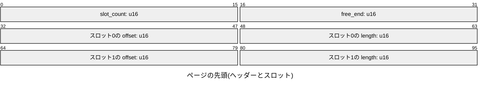
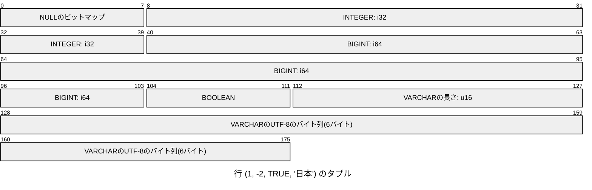

# バイト配置

ページとタプルのバイト配置を示す．数値はすべてリトルエンディアンで書く．
図の目盛りはビットで，8ビットが1バイトである．

## ページ

1つのページは8192バイトである．先頭の4バイトはヘッダーで，そのあとにスロットを並べる．
次の図は，タプルを2つ置いたページの先頭の12バイトである．



- `slot_count`はスロットの数，`free_end`はタプルを置いた領域の始まりの位置(ページの先頭からのバイト数)である．空のページの`free_end`は8192である．
- スロットは，タプルの位置`offset`と長さ`length`を持つ．消したタプルのスロットは，`offset`と`length`を0にする．
- タプルは，ページの末尾から前へ詰めて置く．スロットの並びの終わりから`free_end`までが，空いている領域である．
- タプルを置くには，タプルの長さとスロットの4バイトの空きが要る．1つのタプルの最大の大きさは，8192 - 4 - 4 = 8184バイトである．

```text
0        4                      free_end                   8192
+--------+-----------+----------+-------------+-------------+
| header | slot 0, 1 | 空き      | tuple 1     | tuple 0     |
+--------+-----------+----------+-------------+-------------+
```

## タプル

タプルは，`NULL`の列を表すビットマップのあとに，`NULL`でない列の値を列の順に並べる．
次の図は，`(INTEGER, BIGINT, BOOLEAN, VARCHAR)`の表の行`(1, -2, TRUE, '日本')`のタプル(22バイト)である．



- ビットマップは列ごとに1ビットで，`(列の数 + 7) / 8`バイトである．`i`番目の列が`NULL`なら，`i / 8`バイト目の`i % 8`ビットを1にする．
- `NULL`の列の値は置かない．
- `INTEGER`は4バイト，`BIGINT`は8バイト，`BOOLEAN`は1バイト(`0`か`1`)で表す．
- `VARCHAR`は，2バイトのバイト数と，UTF-8のバイト列で表す．長さは文字の数でなくバイト数である．
