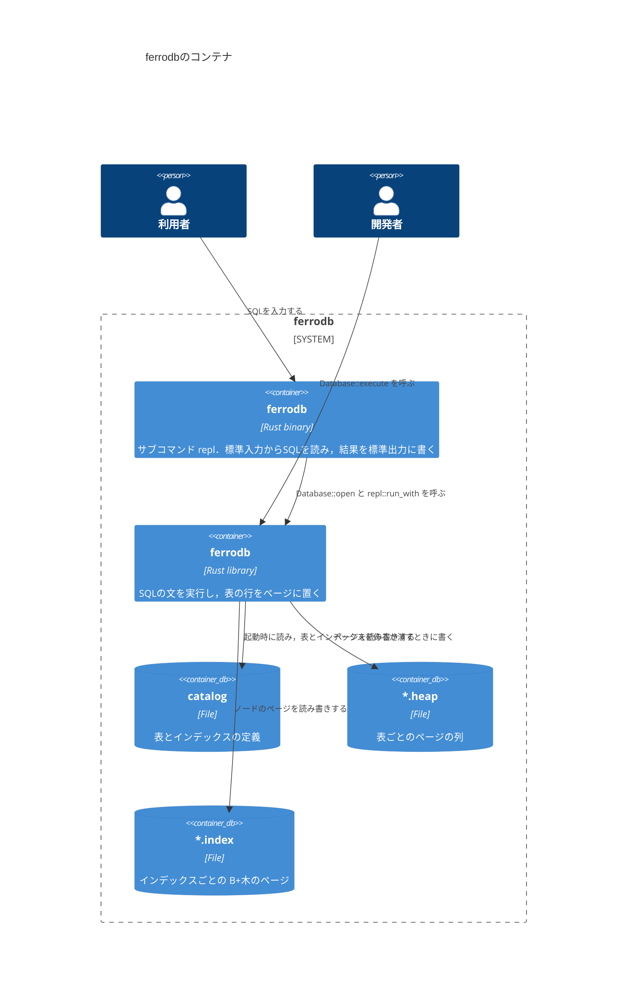

# コンテナ

`ferrodb`を構成する，実行される単位と保存される単位を示す．
REPLのバイナリは，引数`--data-dir`でデータディレクトリを開き，ライブラリの`repl::run_with`に標準入出力を渡す．

- データディレクトリには，カタログのファイル`catalog`と，表ごとのヒープファイルと，インデックスごとのファイルを置く．ファイルの名前は，表やインデックスの名前のUTF-8のバイトを16進数で書いたものに，`.heap`か`.index`を付けたもの(表`T`なら`54.heap`)である．
- `--data-dir`を省略すると，ページをメモリーに置く．REPLを終了すると消える．
- ファイルの中のバイト配置は[layout.md](layout.md)にある．
