# コンポーネント

`ferrodb`のモジュールと，モジュールの間の依存を示す．
`main`がコマンドの引数を読んでデータベースを開き，REPLを起動する．`repl`は文を`database`で実行して，結果を`format`の表示で書く．
`SELECT`は，`plan`で名前解決と実行計画を作り，`exec`の演算子の木で実行する．

```mermaid
C4Component
  title ferrodbのコンポーネント
  Component(main, "main", "Rust module", "標準入出力をREPLに渡す")
  Container_Boundary(library, "ferrodb ライブラリ") {
    Component(root, "crate", "Rust module", "公開する名前をまとめる")
    Component(repl, "repl", "Rust module", "文を区切って実行し，結果を書く")
    Component(format, "format", "Rust module", "結果の表とコマンドタグの表示")
    Component(database, "database", "Rust module", "Database，StatementResult，QueryResult")
    Container_Boundary(sql, "sql") {
      Component(lexer, "sql::lexer", "Rust module", "SQLの文字列をトークンの列に分ける")
      Component(token, "sql::token", "Rust module", "トークンの型")
      Component(parser, "sql::parser", "Rust module", "トークンの列を文の構文木にする")
      Component(ast, "sql::ast", "Rust module", "構文木の型")
    }
    Container_Boundary(plan, "plan") {
      Component(binder, "plan::binder", "Rust module", "FROM の表を引き，式と SELECT の名前を解決する")
      Component(planner, "plan::planner", "Rust module", "SELECT を実行計画にする")
      Component(explain, "plan::explain", "Rust module", "実行計画を EXPLAIN の行にする")
    }
    Container_Boundary(execs, "exec") {
      Component(exec, "exec", "Rust module", "トレイト Executor")
      Component(build, "exec::build", "Rust module", "実行計画から演算子の木を作り，行を集める")
      Component(scan, "exec::scan", "Rust module", "SeqScan")
      Component(index_scan, "exec::index_scan", "Rust module", "IndexScan")
      Component(join, "exec::join", "Rust module", "NestedLoopJoin")
      Component(aggregate, "exec::aggregate", "Rust module", "HashAggregate と集約関数の Accumulator")
      Component(filter, "exec::filter", "Rust module", "Filter")
      Component(project, "exec::project", "Rust module", "Project")
      Component(distinct, "exec::distinct", "Rust module", "Distinct")
      Component(sort, "exec::sort", "Rust module", "Sort と並べ替えの比較")
      Component(limit, "exec::limit", "Rust module", "Limit")
      Component(eval, "exec::eval", "Rust module", "式と条件を評価する")
      Component(dml, "exec::dml", "Rust module", "行を加え，書き換え，消す．制約を検査する")
    }
    Container_Boundary(indexes, "index") {
      Component(index, "index", "Rust module", "AnyIndex と ColumnIndex．列の型ごとの B+木を SQL の値で使う")
      Component(btree, "index::btree", "Rust module", "BTree と RangeIter．キーから行の位置を引く B+木")
      Component(key, "index::key", "Rust module", "IndexKey．順序を保つキーの符号化")
    }
    Container_Boundary(storage, "storage") {
      Component(buffer, "storage::buffer", "Rust module", "BufferPool，PageGuard，ClockReplacer．ページを枠に置いて使い回す")
      Component(disk, "storage::disk", "Rust module", "DiskManager．ページをファイルかメモリーに読み書きする")
      Component(heap, "storage::heap", "Rust module", "HeapFile と RowId．表のタプルを置くページの列")
      Component(page, "storage::page", "Rust module", "8192 バイトのスロット付きページ")
      Component(tuple, "storage::tuple", "Rust module", "行とタプルのバイト列の変換")
    }
    Component(wal, "wal", "Rust module", "WalWriter，WalRecord，Lsn．変更を先に書くログとリカバリ")
    Component(txn, "txn", "Rust module", "TxnId，TransactionManager，Snapshot．版が見えるかの判定")
    Component(catalog, "catalog", "Rust module", "表の定義と，定義との照合")
    Component(value, "value", "Rust module", "値とデータ型")
    Component(error, "error", "Rust module", "Error，SqlState，各段階のエラーからの変換")
  }
  Rel(main, repl, "run_with を呼ぶ")
  Rel(main, root, "Database::open を呼ぶ")
  Rel(root, database, "Database を公開する")
  Rel(root, error, "Error を公開する")
  Rel(root, lexer, "tokenize を公開する")
  Rel(root, token, "Token を公開する")
  Rel(root, value, "Value と DataType を公開する")
  Rel(repl, database, "execute を呼ぶ")
  Rel(format, database, "StatementResult を表示する")
  Rel(format, value, "Value をセルの文字列にする")
  Rel(database, lexer, "tokenize を呼ぶ")
  Rel(database, parser, "parse を呼ぶ")
  Rel(database, ast, "Statement を読む")
  Rel(database, binder, "bind と bind_select を呼ぶ")
  Rel(database, planner, "plan を呼ぶ")
  Rel(database, explain, "explain を呼ぶ")
  Rel(database, build, "build と collect_rows を呼ぶ")
  Rel(database, eval, "VALUES と INSERT の式を eval する")
  Rel(database, dml, "insert，update，delete を呼ぶ")
  Rel(database, catalog, "表を作り，引き，消す．値を列に合わせる")
  Rel(database, value, "行の値を持つ")
  Rel(database, heap, "表ごとに HeapFile を持つ")
  Rel(database, index, "表のインデックスを開き，行で埋める")
  Rel(database, txn, "トランザクションを始め，終え，文ごとにスナップショットを作る")
  Rel(database, wal, "開くときにリカバリし，開始，コミット，中止，チェックポイントを記録する")
  Rel(database, buffer, "インデックスごとに BufferPool を持つ")
  Rel(database, disk, "表のファイルを開く")
  Rel(database, error, "Error を返す")
  Rel(lexer, token, "Token を作る")
  Rel(parser, token, "Token を読む")
  Rel(parser, ast, "Statement を作る")
  Rel(parser, value, "DataType を作る")
  Rel(ast, value, "DataType を持つ")
  Rel(binder, ast, "Expr を読む")
  Rel(binder, catalog, "表を引き，Column の名前を読む")
  Rel(binder, value, "リテラルを Value にする")
  Rel(planner, binder, "BoundSelect を読む")
  Rel(planner, ast, "JoinKind を読む")
  Rel(planner, catalog, "表のインデックスと列の型を読む")
  Rel(planner, value, "キーの範囲を Value で持つ")
  Rel(explain, planner, "PlanNode を読む")
  Rel(explain, binder, "BoundExpr を表示する")
  Rel(explain, ast, "JoinKind を表示する")
  Rel(exec, error, "Error を返す")
  Rel(exec, value, "Row を返す")
  Rel(build, planner, "PlanNode を読む")
  Rel(build, exec, "Box<dyn Executor> を作る")
  Rel(build, scan, "SeqScan を作る")
  Rel(build, join, "NestedLoopJoin を作る")
  Rel(build, aggregate, "HashAggregate を作る")
  Rel(build, filter, "Filter を作る")
  Rel(build, project, "Project を作る")
  Rel(build, distinct, "Distinct を作る")
  Rel(build, sort, "Sort を作る")
  Rel(build, limit, "Limit を作る")
  Rel(build, error, "Error を返す")
  Rel(build, heap, "表の行を読む")
  Rel(build, index_scan, "IndexScan を作る")
  Rel(build, index, "インデックスでキーの範囲の行の位置を引く")
  Rel(build, buffer, "インデックスのプールを受け取る")
  Rel(build, disk, "DiskManager の型を使う")
  Rel(build, tuple, "位置のタプルを行に戻す")
  Rel(build, txn, "スナップショットから見える版だけを読む")
  Rel(build, catalog, "表の定義を引く")
  Rel(build, value, "表の行を読む")
  Rel(scan, exec, "Executor を実装する")
  Rel(scan, error, "Error を返す")
  Rel(scan, value, "Row を返す")
  Rel(index_scan, exec, "Executor を実装する")
  Rel(index_scan, error, "Error を返す")
  Rel(index_scan, value, "Row を返す")
  Rel(join, exec, "Executor を実装する")
  Rel(join, eval, "ON の条件を eval_condition する")
  Rel(join, binder, "BoundExpr を持つ")
  Rel(join, ast, "JoinKind を読む")
  Rel(join, error, "Error を返す")
  Rel(join, value, "行をつなぎ，NULL で埋める")
  Rel(aggregate, exec, "Executor を実装する")
  Rel(aggregate, eval, "キーと引数を eval する")
  Rel(aggregate, binder, "AggregateCall を読む")
  Rel(aggregate, ast, "AggregateFunc を読む")
  Rel(aggregate, error, "Error を返す")
  Rel(aggregate, value, "Value をキーにしてグループを引く")
  Rel(filter, exec, "Executor を実装する")
  Rel(filter, eval, "eval_condition を呼ぶ")
  Rel(filter, binder, "BoundExpr を持つ")
  Rel(filter, error, "Error を返す")
  Rel(filter, value, "Row を返す")
  Rel(project, exec, "Executor を実装する")
  Rel(project, eval, "eval を呼ぶ")
  Rel(project, binder, "BoundExpr を持つ")
  Rel(project, error, "Error を返す")
  Rel(project, value, "Row を返す")
  Rel(distinct, exec, "Executor を実装する")
  Rel(distinct, error, "Error を返す")
  Rel(distinct, value, "Row を比べる")
  Rel(sort, exec, "Executor を実装する")
  Rel(sort, eval, "キーの式を eval する")
  Rel(sort, binder, "SortOrder を読む")
  Rel(sort, planner, "SortKey を読む")
  Rel(sort, error, "Error を返す")
  Rel(limit, exec, "Executor を実装する")
  Rel(limit, error, "Error を返す")
  Rel(limit, value, "Row を返す")
  Rel(eval, binder, "BoundExpr を読む")
  Rel(eval, ast, "演算子を読む")
  Rel(eval, value, "Value を作る")
  Rel(sort, value, "Value の順序で比べる")
  Rel(dml, catalog, "TableSchema の制約を読み，値を列に合わせる")
  Rel(dml, eval, "eval と matches_filter を呼ぶ")
  Rel(dml, binder, "BoundExpr を読む")
  Rel(dml, value, "Row を作る")
  Rel(dml, error, "Error を返す")
  Rel(dml, heap, "行を読み，加え，書き換え，消す")
  Rel(dml, index, "一意性を検査し，インデックスを更新する")
  Rel(dml, txn, "見える版を選び，新しい版にトランザクションの番号を書く")
  Rel(dml, page, "タプルの最大の大きさを調べる")
  Rel(dml, tuple, "行をタプルにする")
  Rel(heap, page, "ページにタプルを置く")
  Rel(heap, buffer, "ページをピン留めして読み書きする")
  Rel(heap, disk, "DiskManager を受け取る")
  Rel(buffer, disk, "ページを読み書きする")
  Rel(buffer, page, "Page を枠に置く")
  Rel(buffer, wal, "書き換えたページを記録し，書き戻す前にログをディスクに届ける")
  Rel(wal, disk, "リカバリでページをファイルに書く")
  Rel(wal, page, "PageBytes を記録する")
  Rel(wal, txn, "リカバリでトランザクションの状態を記録する")
  Rel(disk, page, "PAGE_SIZE と PageBytes を使う")
  Rel(heap, tuple, "タプルを行に戻す")
  Rel(heap, txn, "版の xmax に TxnId を書く")
  Rel(tuple, txn, "ヘッダーに TxnId を持つ")
  Rel(txn, tuple, "TupleHeader の xmin と xmax で判定する")
  Rel(heap, catalog, "TableSchema で復号する")
  Rel(heap, value, "Row を返す")
  Rel(tuple, catalog, "列の型を読む")
  Rel(tuple, value, "Value をバイト列にする")
  Rel(catalog, value, "DataType と Value を読む")
  Rel(error, lexer, "LexError を変換する")
  Rel(error, parser, "ParseError を変換する")
  Rel(error, eval, "EvalError を変換する")
  Rel(error, catalog, "SchemaError を変換する")
  Rel(error, binder, "BindError を変換する")
  Rel(error, dml, "ConstraintError を変換する")
  Rel(error, page, "PageError を変換する")
  Rel(error, heap, "HeapError を変換する")
  Rel(error, btree, "BTreeError を変換する")
  Rel(error, txn, "TransactionError を変換する")
  Rel(error, buffer, "BufferError を変換する")
  Rel(index, btree, "列の型ごとの BTree を持つ")
  Rel(index, key, "IndexKey の型を使う")
  Rel(index, buffer, "木のページのプールを借りる")
  Rel(index, disk, "DiskManager の型を使う")
  Rel(index, heap, "RowId を返す")
  Rel(index, value, "Value をキーにする")
  Rel(btree, key, "キーを符号化し，復号する")
  Rel(btree, buffer, "ノードのページをピン留めして読み書きする")
  Rel(btree, disk, "PageId と DiskManager を使う")
  Rel(btree, heap, "RowId を値に持つ")
  Rel(btree, page, "PAGE_SIZE と Page を使う")
  Rel(error, tuple, "TupleError を変換する")
```

- `sql`，`plan`，`storage`は，子モジュールを宣言するだけのモジュールなので，境界として描いた．`exec`は子モジュールを宣言し，トレイト`Executor`を定義する．
- 演算子のモジュール(`exec::scan`など)は，`exec`の`Executor`を実装する．`exec::build`だけが演算子の型を知っていて，ほかのモジュールは`Box<dyn Executor>`として扱う．
- `repl`は`format`の関数を直接呼ばない．`format`が`StatementResult`に`Display`を実装するので，`repl`は`{}`で書くだけである．
- `exec::dml`と`error`は互いに参照する．`exec::dml`は評価，型の変換，制約のどのエラーも`Error`にして返し，`error`は`exec::dml`の`ConstraintError`を`Error`に変換する．
- `lexer`と`parser`は，外部のクレート`winnow`のパーサーを組み合わせる．`main`は，外部のクレート`clap`でコマンドの引数を読む．
- 単体テストの依存は図に含めない．
- `index`と`storage`は，クレートの外から使えるように公開する．
- `index`は，列の型ごとの`BTree`を`enum AnyIndex`にまとめる．`database`はインデックスごとにバッファプールを持ち，文を実行するたびに`AnyIndex`として開く．
