# バイト配置

データディレクトリのファイル，ページ，タプル，B+木のノード，プロトコルのメッセージのバイト配置を示す．ファイルの数値はリトルエンディアンで，プロトコルの数値はビッグエンディアンで書く．
図の目盛りはビットで，8ビットが1バイトである．

## ページ

1つのページは8192バイトである．先頭の4バイトはヘッダーで，そのあとにスロットを並べる．
次の図は，タプルを2つ置いたページの先頭の12バイトである．

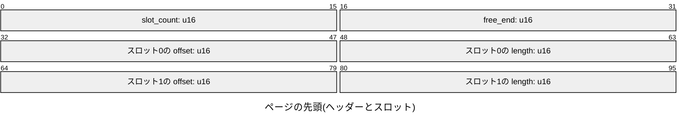

- `slot_count`はスロットの数，`free_end`はタプルを置いた領域の始まりの位置(ページの先頭からのバイト数)である．空のページの`free_end`は8192である．
- スロットは，タプルの位置`offset`と長さ`length`を持つ．消したタプルのスロットは，`offset`と`length`を0にする．
- タプルは，ページの末尾から前へ詰めて置く．スロットの並びの終わりから`free_end`までが，空いている領域である．
- タプルを置くには，タプルの長さとスロットの4バイトの空きが要る．1つのタプルの最大の大きさは，8192 - 4 - 4 = 8184バイトである．

```text
0        4                      free_end                   8192
+--------+-----------+----------+-------------+-------------+
| header | slot 0, 1 | 空き      | tuple 1     | tuple 0     |
+--------+-----------+----------+-------------+-------------+
```

## タプル

ページに置くタプルは，8バイトのヘッダーのあとに，行の値を並べる．

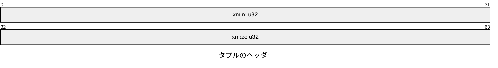

- `xmin`はその版を作ったトランザクションの番号，`xmax`は削除したトランザクションの番号である．削除されていなければ`xmax`は0である．
- `UPDATE`は，古い版の`xmax`を書き換え，新しい版を別のタプルとして置く．`DELETE`は`xmax`を書き換えるだけで，タプルは残る．

行の値は，`NULL`の列を表すビットマップのあとに，`NULL`でない列の値を列の順に並べる．
次の図は，`(INTEGER, BIGINT, BOOLEAN, VARCHAR)`の表の行`(1, -2, TRUE, '日本')`の値(22バイト)である．ヘッダーを合わせたタプルは30バイトである．

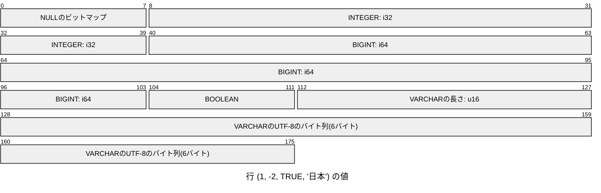

- ビットマップは列ごとに1ビットで，`(列の数 + 7) / 8`バイトである．`i`番目の列が`NULL`なら，`i / 8`バイト目の`i % 8`ビットを1にする．
- `NULL`の列の値は置かない．
- `INTEGER`は4バイト，`BIGINT`は8バイト，`BOOLEAN`は1バイト(`0`か`1`)で表す．
- `VARCHAR`は，2バイトのバイト数と，UTF-8のバイト列で表す．長さは文字の数でなくバイト数である．

## ヒープファイル

ヒープファイルは，表のページを番号の順に並べたファイルである．`page_id`番目のページは，ファイルの`page_id * 8192`バイト目から始まる．
ファイルの大きさは，ページの数の8192倍である．

```text
0          8192       16384      24576
+----------+----------+----------+
| page 0   | page 1   | page 2   |
+----------+----------+----------+
```

## カタログ

カタログのファイルは，表の定義を表の名前の順に並べる．文字列は，2バイトのバイト数とUTF-8のバイト列で書く．
次の図は，カタログのファイルの先頭と，1つ目の表の定義の始まりである．

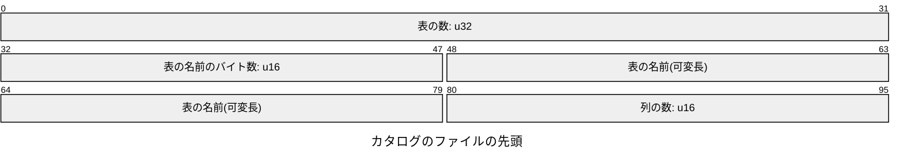

列ごとに，次の値を並べる．

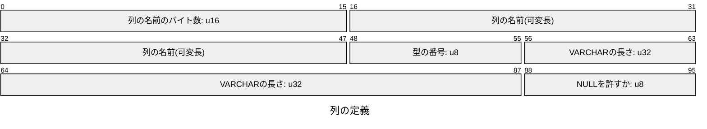

- 型の番号は，`INTEGER`が0，`BIGINT`が1，`BOOLEAN`が2，`VARCHAR`が3である．`VARCHAR`でなければ，長さは0である．
- 列の定義のあとに，一意性制約の数(`u16`)と，制約ごとに名前(文字列)と列の番号(`u16`)を並べる．
- すべての表の定義のあとに，インデックスの数(`u32`)と，インデックスごとに名前(文字列)，表の名前(文字列)，列の番号(`u16`)を，インデックスの名前の順に並べる．一意性制約のインデックスもここに書く．
- 図の可変長の欄は，名前が4バイトの場合の幅で描いた．
- カタログは`CREATE TABLE`，`DROP TABLE`，`CREATE INDEX`，`DROP INDEX`のたびに書き直す．`catalog.tmp`に書いてから`catalog`に名前を変えるので，書いている途中で止まっても，前のカタログが残る．

## B+木のノード

B+木は，1つのファイルのページにノードを置く．ページ0はメタページで，先頭の4バイトに根のページ番号を書く．ページ1から先がノードである．
インデックスのファイルの名前は，インデックスの名前のUTF-8のバイトの16進数に`.index`を付けたもの(`EMP_SALARY`なら`454d505f53414c415259.index`)である．
ノードは，7バイトのヘッダーのあとに項目を並べる．項目のあとは0で埋める．

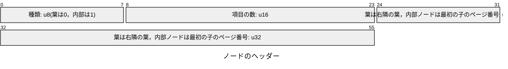

葉の項目は，キーと行の位置である．

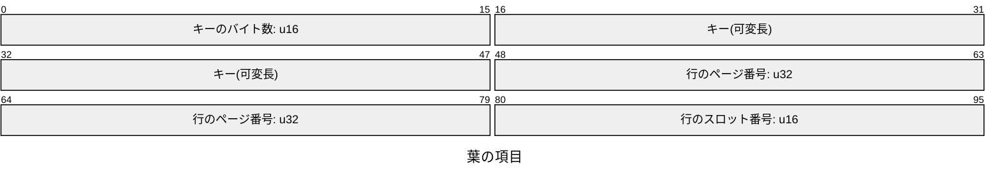

内部ノードの項目は，区切り(葉の項目と同じ形)と，区切り以上の項目を持つ子のページ番号である．

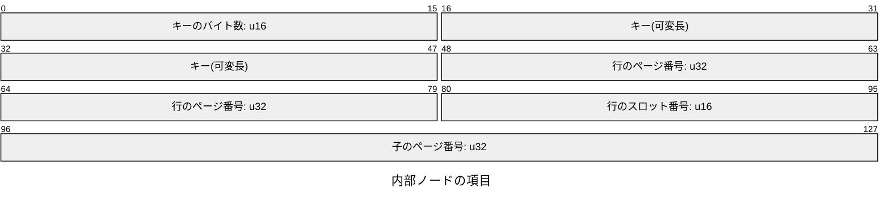

- 右隣の葉がなければ，ページ番号を`0xffffffff`にする．
- 図の可変長の欄は，キーが4バイトの場合の幅で描いた．
- キーは`IndexKey::encode`で符号化したバイト列である．`INTEGER`は符号ビットを反転した4バイトのビッグエンディアン，`BIGINT`は同じく8バイト，`BOOLEAN`は1バイト，`VARCHAR`はUTF-8のバイト列である．キーのバイト列だけはビッグエンディアンで，辞書式に比べると値の順になる．

## トランザクションの状態

データディレクトリのファイル`xact`は，トランザクションの番号ごとに1バイトの状態を，番号の順に並べる．`n`バイト目が番号`n`のトランザクションの状態である．

| 値 | 状態 |
| --- | --- |
| 0 | 進行中．ファイルを読むときは，中止したものとみなす |
| 1 | コミット済み |
| 2 | 中止 |

- 番号0は使わないので，先頭のバイトは2(中止)である．
- チェックポイントで，`xact.tmp`に書いてディスクに届けてから，`xact`に名前を変える．チェックポイントのあとの状態の変化は，ログの`Begin`，`Commit`，`Abort`のレコードにある．

## ログ

ログのファイル`wal`は，レコードを書いた順に並べる．レコードは，内容のバイト数とCRC-32の8バイトのあとに，内容を置く．

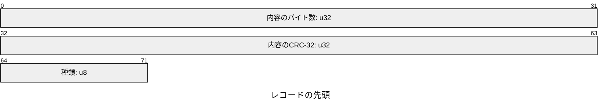

| 種類 | レコード | 種類のあとの内容 |
| --- | --- | --- |
| 1 | `Begin` | トランザクションの番号(`u32`) |
| 2 | `Commit` | トランザクションの番号(`u32`) |
| 3 | `Abort` | トランザクションの番号(`u32`) |
| 4 | `PageImage` | ファイルの名前(2バイトのバイト数とUTF-8)，ページの番号(`u32`)，ページの8192バイト |
| 5 | `Checkpoint` | なし |

- CRC-32は，種類から後ろの内容について計算する．
- レコードの終わりの位置(ファイルの先頭からのバイト数)を，そのレコードのLSNとする．
- 読むときは，内容のバイト数だけのバイトがないか，CRC-32が合わないレコードで止まり，そこから後ろを捨てる．
- `PageImage`はページの内容を丸ごと記録するので，同じレコードを何度やり直しても，ページは同じ内容になる．そのため，最後に反映したLSNをページの中へ書かず，枠に`page_lsn`として持つ．

## プロトコルのメッセージ

PostgreSQLのフロントエンド/バックエンドプロトコル3.0のメッセージである．数値はビッグエンディアンで，文字列はUTF-8のバイトのあとに0のバイトを置く．
起動のあとのメッセージは，種類の1バイトと長さの4バイトのあとに内容を置く．長さは自分の4バイトを含み，種類のバイトを含まない．

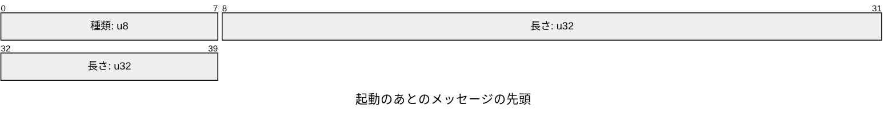

クライアントが最初に送る起動のメッセージには，種類のバイトがない．長さのあとの4バイトが，プロトコルの番号か要求の番号である．

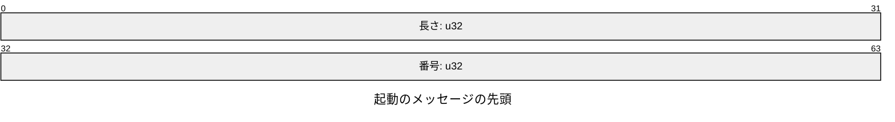

| 番号 | メッセージ | 番号のあとの内容 |
| --- | --- | --- |
| 196608(3.0) | 起動 | 名前と値の文字列の組の並びと，0のバイト |
| 80877103 | SSLの要求 | なし |
| 80877104 | GSSAPIの暗号化の要求 | なし |

暗号化の要求には，メッセージでなく1バイトの`N`で断る．クライアントは，同じ接続で起動のメッセージを送り直す．

| 送る側 | 種類 | メッセージ | 内容 |
| --- | --- | --- | --- |
| クライアント | `Q` | `Query` | SQLの文字列 |
| クライアント | `X` | `Terminate` | なし |
| サーバー | `R` | `AuthenticationOk` | 0(`u32`) |
| サーバー | `S` | `ParameterStatus` | 設定の名前と値の文字列 |
| サーバー | `Z` | `ReadyForQuery` | トランザクションの状態の1バイト(`I`，`T`，`E`) |
| サーバー | `T` | `RowDescription` | 列の数(`i16`)と，列ごとの名前の文字列，表のOID(`u32`)，列の番号(`i16`)，型OID(`u32`)，型の大きさ(`i16`)，型の修飾子(`i32`)，形式(`i16`) |
| サーバー | `D` | `DataRow` | 値の数(`i16`)と，値ごとのバイト数(`i32`)とバイト列．`NULL`はバイト数を-1にして，バイト列を置かない |
| サーバー | `C` | `CommandComplete` | コマンドタグの文字列(`SELECT 2`，`INSERT 0 1`など) |
| サーバー | `I` | `EmptyQueryResponse` | なし |
| サーバー | `E` | `ErrorResponse` | フィールドの種類の1バイトと文字列の組の並びと，0のバイト |

- `RowDescription`の表のOIDと列の番号は0，型の修飾子は-1，形式は0(テキスト形式)にする．
- `DataRow`の値は，REPLの表のセルと同じテキスト形式である．真偽値は`t`と`f`にする．
- `ErrorResponse`は，重大度`S`と`V`(`ERROR`)，SQLSTATE`C`，メッセージ`M`のフィールドを置き，位置のあるエラーには位置`P`(先頭の文字を1と数える10進数の文字列)を加える．
