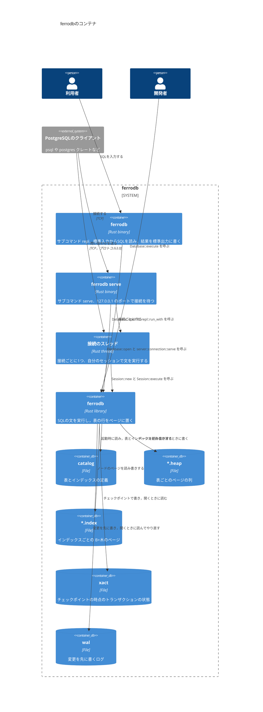

# コンテナ

`ferrodb`を構成する，実行される単位と保存される単位を示す．
バイナリのサブコマンド`repl`は，ライブラリの`repl::run_with`に標準入出力を渡す．サブコマンド`serve`は，TCPの接続を受け付けるたびにスレッドを作り，そのスレッドで`server::connection::handle`を呼ぶ．
どちらのサブコマンドも，引数`--data-dir`でデータディレクトリを開く．

- データディレクトリには，カタログのファイル`catalog`と，表ごとのヒープファイルと，インデックスごとのファイルを置く．ファイルの名前は，表やインデックスの名前のUTF-8のバイトを16進数で書いたものに，`.heap`か`.index`を付けたもの(表`T`なら`54.heap`)である．
- 変更は，まずログのファイル`wal`に書く．開くときは，`xact`のトランザクションの状態から始めて，`wal`の最後のチェックポイントのあとをやり直す．
- `--data-dir`を省略すると，ページをメモリーに置く．プロセスを終了すると消える．
- `serve`のスレッドは，どれも同じ`Database`を`Arc`で共有し，接続ごとの`Session`を持つ．複数のクライアントが同時に問い合わせられる．待ち受けるポートは`--port`で決め，省略すると5433である．
- ファイルの中のバイト配置は[layout.md](layout.md)にある．
