# 処理の流れ

## REPL

REPLが行を読み，`;`で終わった文を実行して結果を書く流れを示す．

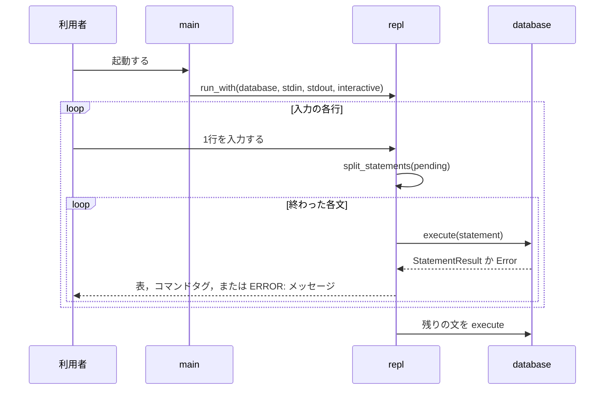
```mermaid
sequenceDiagram
  participant user as 利用者
  participant main
  participant repl
  participant database
  user->>main: 起動する
  main->>repl: run_with(database, stdin, stdout, interactive)
  loop 入力の各行
    user->>repl: 1行を入力する
    repl->>repl: split_statements(pending)
    loop 終わった各文
      repl->>database: execute(statement)
      database-->>repl: StatementResult か Error
      repl-->>user: 表，コマンドタグ，または ERROR: メッセージ
    end
  end
  repl->>database: 残りの文を execute
```

- `split_statements`は，引用符の外の`;`で文を区切る．区切った文と，まだ終わっていない残りを返す．
- `interactive`が真なら，文の途中かどうかでプロンプト`ferrodb>`か`->`を書く．どちらも9文字の幅で，最後に空白を1つ置く．
- 問い合わせの結果の表のあとには空行を書く．

## 起動

`ferrodb repl --data-dir DIR`で起動したとき，データディレクトリのデータベースを開く流れを示す．

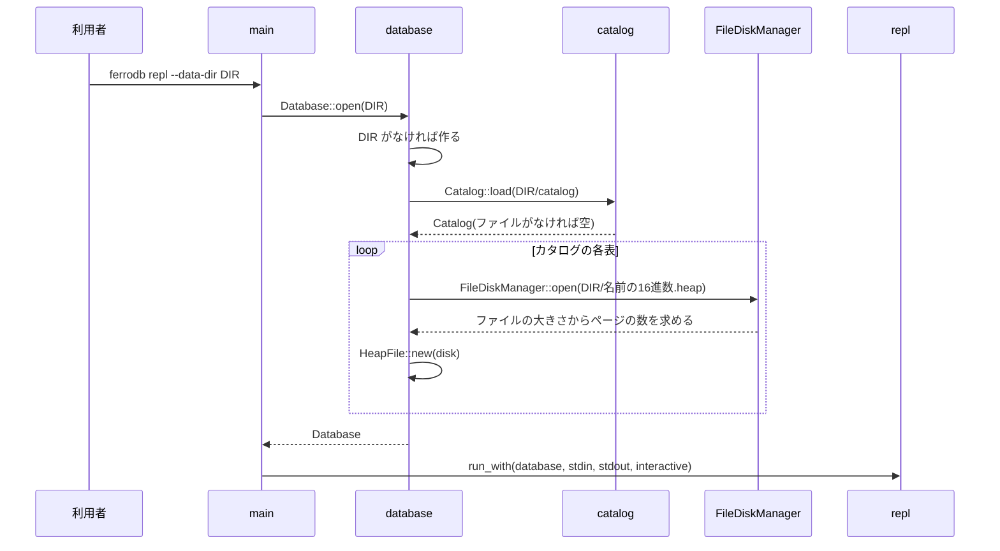
```mermaid
sequenceDiagram
  participant user as 利用者
  participant main
  participant database
  participant catalog
  participant disk as FileDiskManager
  participant repl
  user->>main: ferrodb repl --data-dir DIR
  main->>database: Database::open(DIR)
  database->>database: DIR がなければ作る
  database->>catalog: Catalog::load(DIR/catalog)
  catalog-->>database: Catalog(ファイルがなければ空)
  loop カタログの各表
    database->>disk: FileDiskManager::open(DIR/名前の16進数.heap)
    disk-->>database: ファイルの大きさからページの数を求める
    database->>database: HeapFile::new(disk)
  end
  database-->>main: Database
  main->>repl: run_with(database, stdin, stdout, interactive)
```

- `--data-dir`を省略すると，`Database::new`でメモリーのデータベースを作る．
- データディレクトリを開けなければ，`main`はエラーを標準エラー出力に書いて終わる．

## SELECT

`Database::execute`が`SELECT`を実行する流れを示す．名前を解決し，実行計画を作り，演算子の木で実行する．
図の実行計画は`SELECT name FROM users WHERE id > 1 ORDER BY name`のものである．

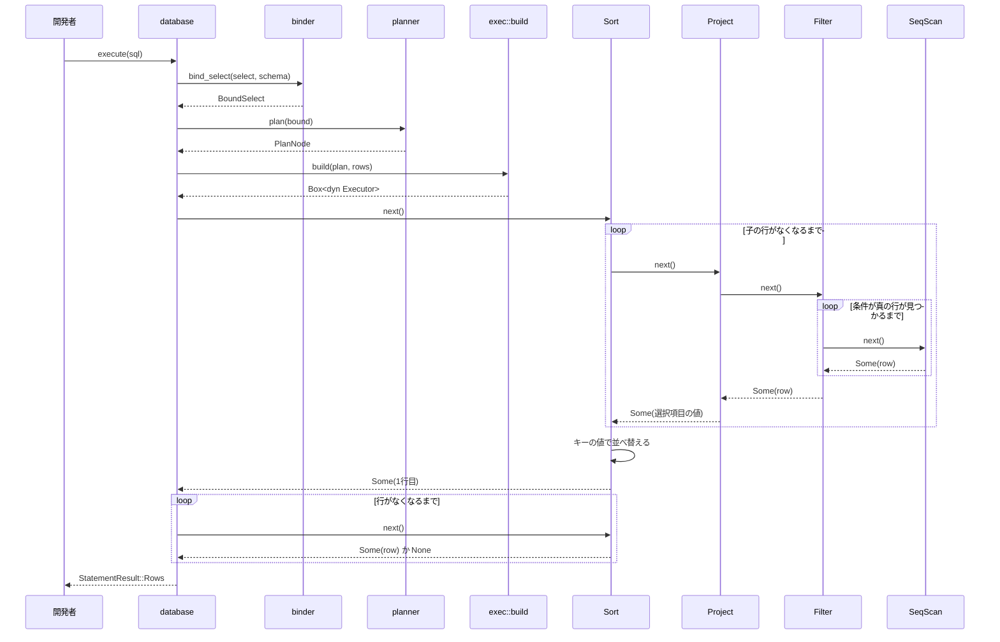
```mermaid
sequenceDiagram
  participant developer as 開発者
  participant database
  participant binder
  participant planner
  participant build as exec::build
  participant sort as Sort
  participant project as Project
  participant filter as Filter
  participant scan as SeqScan
  developer->>database: execute(sql)
  database->>binder: bind_select(select, schema)
  binder-->>database: BoundSelect
  database->>planner: plan(bound)
  planner-->>database: PlanNode
  database->>build: build(plan, rows)
  build-->>database: Box<dyn Executor>
  database->>sort: next()
  loop 子の行がなくなるまで
    sort->>project: next()
    project->>filter: next()
    loop 条件が真の行が見つかるまで
      filter->>scan: next()
      scan-->>filter: Some(row)
    end
    filter-->>project: Some(row)
    project-->>sort: Some(選択項目の値)
  end
  sort->>sort: キーの値で並べ替える
  sort-->>database: Some(1行目)
  loop 行がなくなるまで
    database->>sort: next()
    sort-->>database: Some(row) か None
  end
  database-->>developer: StatementResult::Rows
```

- 演算子は，親に`next`を呼ばれたときに，子の`next`を呼んで1行ずつ受け取る(Volcanoモデル)．`SeqScan`は行がなくなると`None`を返し，`None`は親へ順に伝わる．
- `Sort`は，最初の`next`で子の行をすべて読んで並べ替える．それ以外の演算子は，1行を受け取るたびに1行を返す．
- 実行計画の演算子は，下から`SeqScan`(結合なら`NestedLoopJoin`)，`Filter`(`WHERE`)，`HashAggregate`，`Filter`(`HAVING`)，`Project`，`Distinct`，`Sort`，`Limit`の順に重ねる．`Project`と`SeqScan`以外は，その句がなければ置かない．`HashAggregate`は集約する問い合わせにだけ置く．
- 結果の列にない式で並べ替えるときは，下の`Project`がその式を隠れた列として計算し，最上段の`Project`が取り除く．
- `ORDER BY`の名前だけのキーは，まず結果の列名(別名を含む)から探し，なければ表の列として解決する．選択項目と同じ式のキーは，結果の列の値を使う．
- `EXPLAIN`は，同じ実行計画を`plan::explain`で行の並びにして返す．演算子は実行しない．
- `Filter`は，条件が偽か`NULL`の行を返さない．条件が真偽値でなければ`ArgumentNotBoolean`になる．
- `Distinct`は`NULL`どうしを同じ値とみなす．`DISTINCT`では，結果の列から値を取れないキーは`OrderByNotInSelectList`になる．
- 並べ替えは安定である．すべてのキーが等しい行は，子の演算子が返した順序を保つ．
- どの段階でエラーが起きても，`execute`はそこで止まり，`?`が`From`の実装で段階のエラーを`Error`に変換して返す．
- `*`は，表のすべての列を指す`BoundExpr::Column`に展開する．
- 結果の列名は，別名，列の名前，`?column?`の順に決める．
- `VALUES`と`INSERT`の式は，列のない空の行について評価する．列を参照すると名前解決で`UndefinedColumn`になる．
- 式の優先順位は次のとおりである．
  - `OR`：1，`AND`：2，`NOT`：3，`IS [NOT] NULL`：4，比較：5(結合性なし)，連結`||`：7，加減算：10，乗除算：20，単項の`-`：30

## 入れ子ループ結合

`NestedLoopJoin`が`next`を呼ばれて，結合した行を返す流れを示す．
図の実行計画は`SELECT * FROM emp e LEFT JOIN dept d ON e.dept = d.code`のものである．

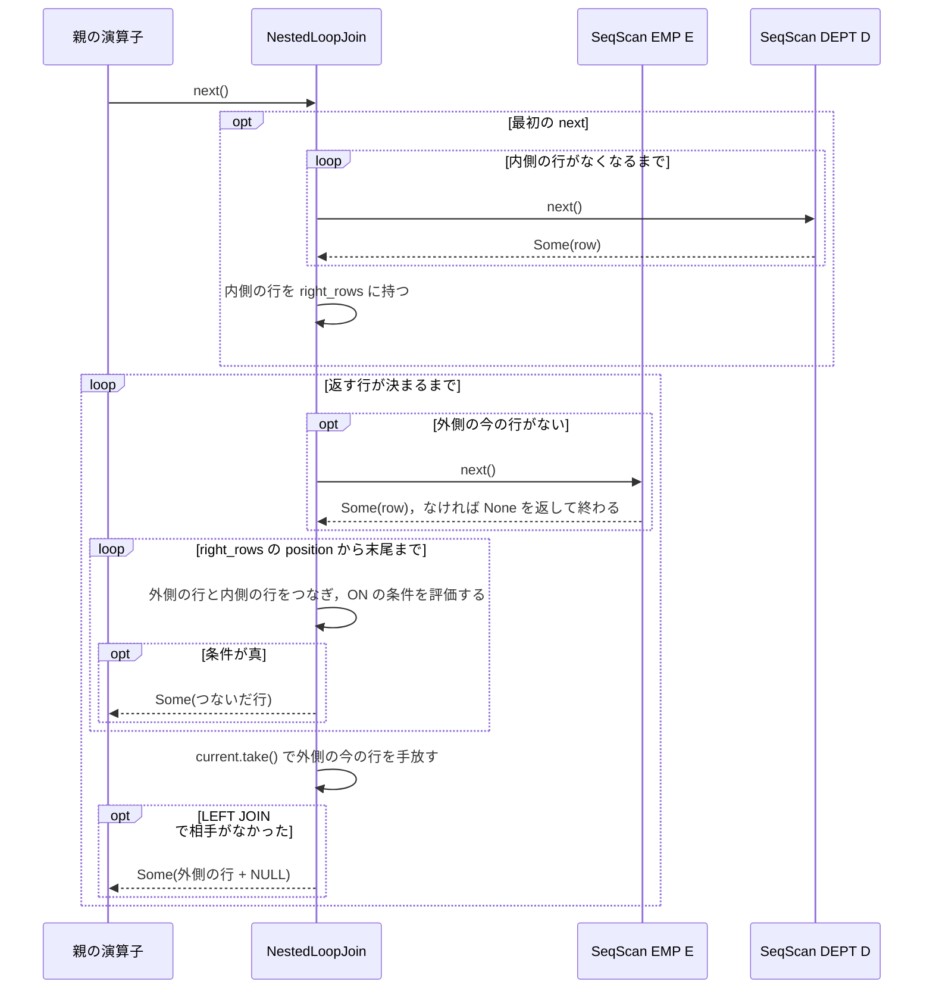
```mermaid
sequenceDiagram
  participant parent as 親の演算子
  participant join as NestedLoopJoin
  participant left as SeqScan EMP E
  participant right as SeqScan DEPT D
  parent->>join: next()
  opt 最初の next
    loop 内側の行がなくなるまで
      join->>right: next()
      right-->>join: Some(row)
    end
    join->>join: 内側の行を right_rows に持つ
  end
  loop 返す行が決まるまで
    opt 外側の今の行がない
      join->>left: next()
      left-->>join: Some(row)，なければ None を返して終わる
    end
    loop right_rows の position から末尾まで
      join->>join: 外側の行と内側の行をつなぎ，ON の条件を評価する
      opt 条件が真
        join-->>parent: Some(つないだ行)
      end
    end
    join->>join: current.take() で外側の今の行を手放す
    opt LEFT JOIN で相手がなかった
      join-->>parent: Some(外側の行 + NULL)
    end
  end
```

- 内側の行は最初の`next`で1度だけ読み，外側の行ごとに`right_rows`の先頭から照らし合わせる．
- 条件を満たす組を返すと，`position`を覚えたまま戻る．次の`next`は，同じ外側の行の続きから照らし合わせる．
- `CROSS JOIN`と`,`は条件を持たず，すべての組を返す．
- `ON`の条件が真偽値でなければ，`ArgumentNotBoolean`(`JOIN/ON`)になる．

## 集約

`HashAggregate`が，子の行をグループにまとめて集約した行を返す流れを示す．
図の実行計画は`SELECT dept, COUNT(*) AS n, SUM(salary) AS total FROM emp GROUP BY dept HAVING COUNT(*) > 1`のものである．

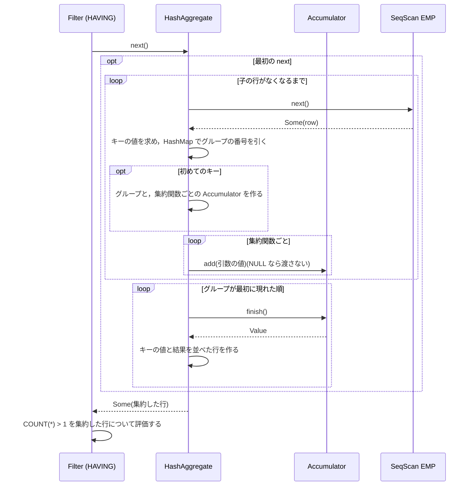
```mermaid
sequenceDiagram
  participant filter as Filter (HAVING)
  participant aggregate as HashAggregate
  participant accumulator as Accumulator
  participant scan as SeqScan EMP
  filter->>aggregate: next()
  opt 最初の next
    loop 子の行がなくなるまで
      aggregate->>scan: next()
      scan-->>aggregate: Some(row)
      aggregate->>aggregate: キーの値を求め，HashMap でグループの番号を引く
      opt 初めてのキー
        aggregate->>aggregate: グループと，集約関数ごとの Accumulator を作る
      end
      loop 集約関数ごと
        aggregate->>accumulator: add(引数の値)(NULL なら渡さない)
      end
    end
    loop グループが最初に現れた順
      aggregate->>accumulator: finish()
      accumulator-->>aggregate: Value
      aggregate->>aggregate: キーの値と結果を並べた行を作る
    end
  end
  aggregate-->>filter: Some(集約した行)
  filter->>filter: COUNT(*) > 1 を集約した行について評価する
```

- `HashMap`はキーの値の並びからグループの番号を引き，グループの`Accumulator`は番号の順で`Vec`へ置く．結果は，グループが最初に現れた順でなる．
- キーの`NULL`どうしは同じグループになる．
- `GROUP BY`がなければ，行が1つもなくてもグループを1つ作る．`COUNT`は0，ほかの集約関数は`NULL`を返す．
- 集約した行は，キーの値のあとに集約関数の結果を並べたものである．`HAVING`，選択項目，`ORDER BY`の式は，この行の列を参照する．

## UPDATE

`Database::execute`が`UPDATE`を実行する流れを示す．新しい行をすべて計算し，制約とタプルの大きさを検査してから，古い版を削除済みにして新しい版を置く．

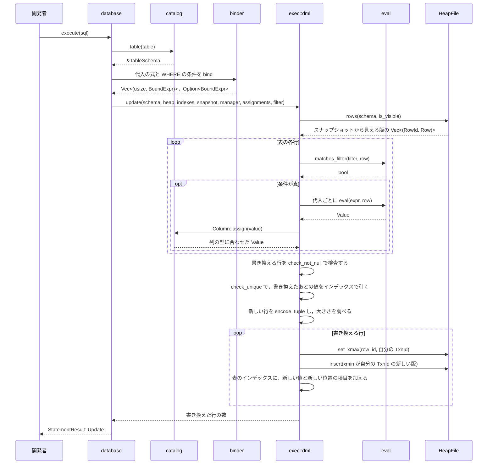
```mermaid
sequenceDiagram
  participant developer as 開発者
  participant database
  participant catalog
  participant binder
  participant dml as exec::dml
  participant eval
  participant heap as HeapFile
  developer->>database: execute(sql)
  database->>catalog: table(table)
  catalog-->>database: &TableSchema
  database->>binder: 代入の式と WHERE の条件を bind
  binder-->>database: Vec<(usize, BoundExpr)>，Option<BoundExpr>
  database->>dml: update(schema, heap, indexes, snapshot, manager, assignments, filter)
  dml->>heap: rows(schema, is_visible)
  heap-->>dml: スナップショットから見える版の Vec<(RowId, Row)>
  loop 表の各行
    dml->>eval: matches_filter(filter, row)
    eval-->>dml: bool
    opt 条件が真
      dml->>eval: 代入ごとに eval(expr, row)
      eval-->>dml: Value
      dml->>catalog: Column::assign(value)
      catalog-->>dml: 列の型に合わせた Value
    end
  end
  dml->>dml: 書き換える行を check_not_null で検査する
  dml->>dml: check_unique で，書き換えたあとの値をインデックスで引く
  dml->>dml: 新しい行を encode_tuple し，大きさを調べる
  loop 書き換える行
    dml->>heap: set_xmax(row_id, 自分の TxnId)
    dml->>heap: insert(xmin が自分の TxnId の新しい版)
    dml->>dml: 表のインデックスに，新しい値と新しい位置の項目を加える
  end
  dml-->>database: 書き換えた行の数
  database-->>developer: StatementResult::Update
```

- 代入の式は，すべて書き換える前の行で評価する．`SET a = b, b = a`は2つの列の値を入れ替える．
- 評価，型の変換，制約の検査，タプルの大きさの検査のどこでエラーになっても，ページを書き換える前に止まるので，表は変わらない．
- 一意性制約は，書き換えたあとの値をインデックスで引いて検査する．見つかった行が書き換える行のどれかなら，違反としない．`SET id = id + 1`は，書き換えの途中で値が重なっても，終わったときに一意なら成功する．
- `INSERT`も，加える行をすべて評価し，`Column::assign`で列の型に合わせてから`exec::dml::insert`に渡す．`insert`は，新しい行の値をインデックスで引いて制約を検査してから，`HeapFile::insert`でタプルを置き，インデックスに項目を加える．
- `DELETE`は，先にすべての行の条件を評価し，途中でエラーにならなければ，条件を満たした行の`RowId`のタプルを消す．
- `SELECT`の`SeqScan`は，`exec::build`が`HeapFile::rows`で復号した行を持つ．

## ページの取得

`HeapFile`がページを`BufferPool::fetch_page`で取得し，ピン留めして書き換える流れを示す．枠がすべて使われているときは，クロック方式で選んだページを追い出す．

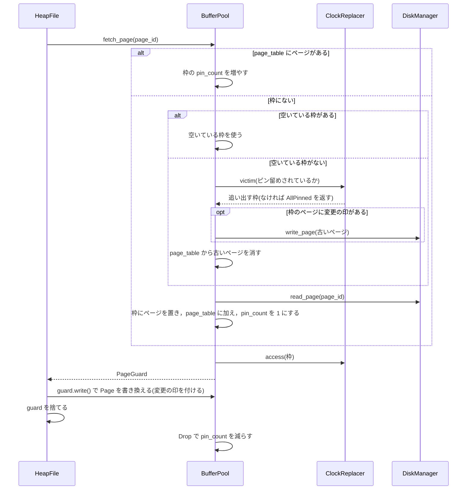
```mermaid
sequenceDiagram
  participant heap as HeapFile
  participant pool as BufferPool
  participant clock as ClockReplacer
  participant disk as DiskManager
  heap->>pool: fetch_page(page_id)
  alt page_table にページがある
    pool->>pool: 枠の pin_count を増やす
  else 枠にない
    alt 空いている枠がある
      pool->>pool: 空いている枠を使う
    else 空いている枠がない
      pool->>clock: victim(ピン留めされているか)
      clock-->>pool: 追い出す枠(なければ AllPinned を返す)
      opt 枠のページに変更の印がある
        pool->>disk: write_page(古いページ)
      end
      pool->>pool: page_table から古いページを消す
    end
    pool->>disk: read_page(page_id)
    pool->>pool: 枠にページを置き，page_table に加え，pin_count を 1 にする
  end
  pool->>clock: access(枠)
  pool-->>heap: PageGuard
  heap->>pool: guard.write() で Page を書き換える(変更の印を付ける)
  heap->>heap: guard を捨てる
  pool->>pool: Drop で pin_count を減らす
```

- `PageGuard`を捨てるまで，枠のページは追い出されない．`HeapFile`は1つの操作の間だけ`PageGuard`を持つ．
- `ClockReplacer::victim`は，ピン留めされた枠を飛ばし，参照ビットが立った枠はビットを下ろして次へ進む．すべての枠がピン留めされていれば`None`を返し，`fetch_page`は`BufferError::AllPinned`を返す．
- 変更の印のあるページは，追い出すときのほかに，`BufferPool`を捨てるとき(`Database`を捨てるとき)にも書き戻す．

## B+木への挿入

`BTree::insert`で葉がいっぱいになり，葉を分割する流れを示す．

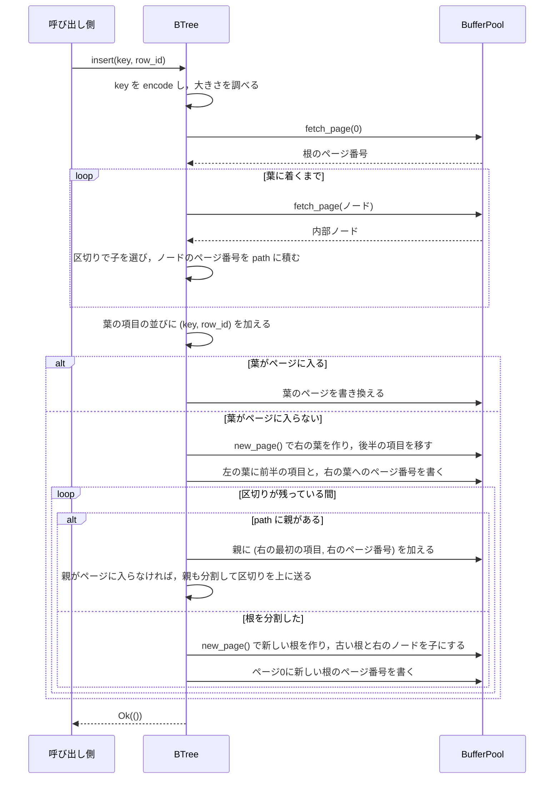
```mermaid
sequenceDiagram
  participant caller as 呼び出し側
  participant tree as BTree
  participant pool as BufferPool
  caller->>tree: insert(key, row_id)
  tree->>tree: key を encode し，大きさを調べる
  tree->>pool: fetch_page(0)
  pool-->>tree: 根のページ番号
  loop 葉に着くまで
    tree->>pool: fetch_page(ノード)
    pool-->>tree: 内部ノード
    tree->>tree: 区切りで子を選び，ノードのページ番号を path に積む
  end
  tree->>tree: 葉の項目の並びに (key, row_id) を加える
  alt 葉がページに入る
    tree->>pool: 葉のページを書き換える
  else 葉がページに入らない
    tree->>pool: new_page() で右の葉を作り，後半の項目を移す
    tree->>pool: 左の葉に前半の項目と，右の葉へのページ番号を書く
    loop 区切りが残っている間
      alt path に親がある
        tree->>pool: 親に (右の最初の項目, 右のページ番号) を加える
        tree->>tree: 親がページに入らなければ，親も分割して区切りを上に送る
      else 根を分割した
        tree->>pool: new_page() で新しい根を作り，古い根と右のノードを子にする
        tree->>pool: ページ0に新しい根のページ番号を書く
      end
    end
  end
  tree-->>caller: Ok(())
```

- 葉を分けるときは，右の葉の最初の項目の複製を区切りとして親に加える．内部ノードを分けるときは，真ん中の区切りを右のノードから取り除いて親に送る．
- 分ける位置は，項目の数でなく，項目のバイト数がほぼ半分になる位置である．キーの長さが違っても，どちらのノードもページに入る．
- 削除では，葉から項目を消すだけで，ノードを併合しない．

## スキャン方法の選択

`SELECT name FROM emp WHERE salary >= 450 AND dept = 'ops'`で，プランナーがインデックスを使うかを決め，`IndexScan`で行を読む流れを示す．

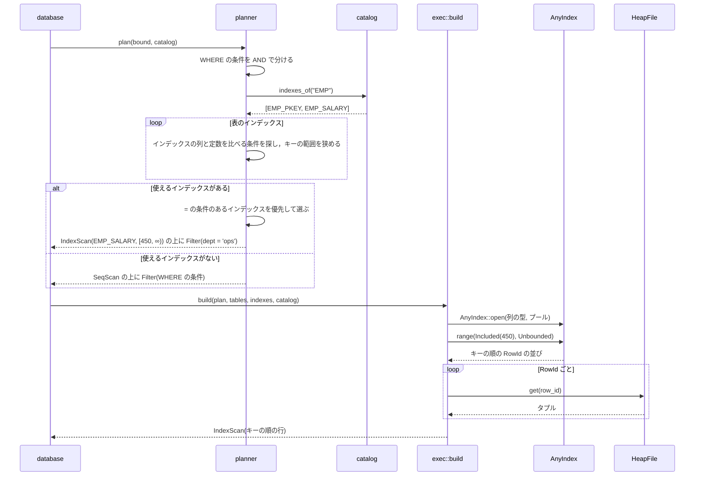
```mermaid
sequenceDiagram
  participant database
  participant planner
  participant catalog
  participant build as exec::build
  participant index as AnyIndex
  participant heap as HeapFile
  database->>planner: plan(bound, catalog)
  planner->>planner: WHERE の条件を AND で分ける
  planner->>catalog: indexes_of("EMP")
  catalog-->>planner: [EMP_PKEY, EMP_SALARY]
  loop 表のインデックス
    planner->>planner: インデックスの列と定数を比べる条件を探し，キーの範囲を狭める
  end
  alt 使えるインデックスがある
    planner->>planner: = の条件のあるインデックスを優先して選ぶ
    planner-->>database: IndexScan(EMP_SALARY, [450, ∞)) の上に Filter(dept = 'ops')
  else 使えるインデックスがない
    planner-->>database: SeqScan の上に Filter(WHERE の条件)
  end
  database->>build: build(plan, tables, indexes, catalog)
  build->>index: AnyIndex::open(列の型, プール)
  build->>index: range(Included(450), Unbounded)
  index-->>build: キーの順の RowId の並び
  loop RowId ごと
    build->>heap: get(row_id)
    heap-->>build: タプル
  end
  build-->>database: IndexScan(キーの順の行)
```

- インデックスを使えるのは，1つの表を読む`SELECT`の`WHERE`で，`AND`でつないだ`列 比較 定数`の条件である．比較は`=`，`<`，`<=`，`>`，`>=`とする．`定数 比較 列`は向きを変えて扱う．
- 定数は`Column::assign`で列の型に変換する．変換できない定数や`NULL`との比較には，インデックスを使わない．
- 範囲を決めた条件は`IndexScan`が満たすので，`Filter`には残りの条件だけを置く．残りがなければ`Filter`を置かない．
- `INSERT`，`UPDATE`，`DELETE`は，`exec::dml`で行を変えるたびに，表のすべてのインデックスの項目を加え，消す．一意性制約は，変える行の値をインデックスで引いて検査する．

## トランザクション

`START TRANSACTION`，`DELETE`，`ROLLBACK`，`SELECT`を順に実行したときの，セッションの状態とトランザクションの状態の変化を示す．

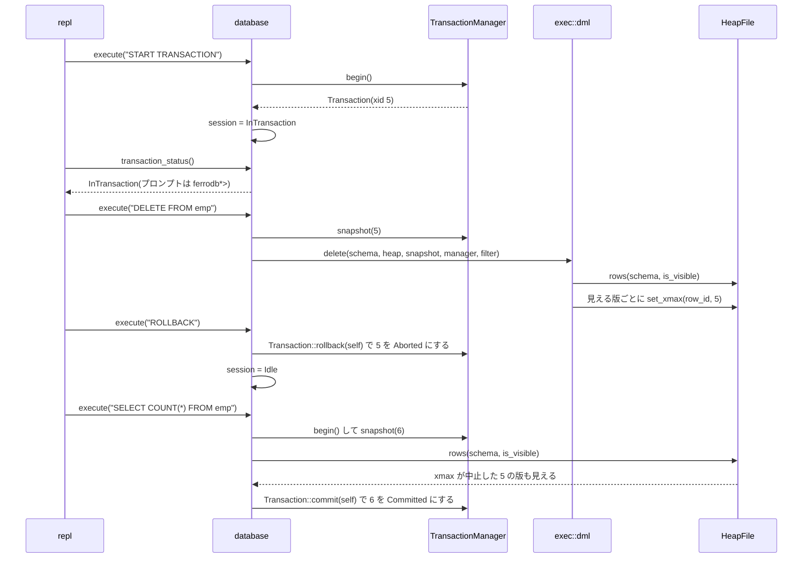
```mermaid
sequenceDiagram
  participant repl
  participant database
  participant manager as TransactionManager
  participant dml as exec::dml
  participant heap as HeapFile
  repl->>database: execute("START TRANSACTION")
  database->>manager: begin()
  manager-->>database: Transaction(xid 5)
  database->>database: session = InTransaction
  repl->>database: transaction_status()
  database-->>repl: InTransaction(プロンプトは ferrodb*>)
  repl->>database: execute("DELETE FROM emp")
  database->>manager: snapshot(5)
  database->>dml: delete(schema, heap, snapshot, manager, filter)
  dml->>heap: rows(schema, is_visible)
  dml->>heap: 見える版ごとに set_xmax(row_id, 5)
  repl->>database: execute("ROLLBACK")
  database->>manager: Transaction::rollback(self) で 5 を Aborted にする
  database->>database: session = Idle
  repl->>database: execute("SELECT COUNT(*) FROM emp")
  database->>manager: begin() して snapshot(6)
  database->>heap: rows(schema, is_visible)
  heap-->>database: xmax が中止した 5 の版も見える
  database->>manager: Transaction::commit(self) で 6 を Committed にする
```

- トランザクションの外の文は，それだけのトランザクションを始め，成功すればコミットし，失敗すれば中止する．
- トランザクションの中でエラーになると，セッションは`Failed`になり，`COMMIT`か`ROLLBACK`までほかの文を`25P02`で断る．`Failed`での`COMMIT`は中止になり，`ROLLBACK`を返す．
- 中止は，トランザクションの状態を`Aborted`にするだけである．版を消したり書き戻したりしない．中止したトランザクションが作った版は見えず，削除した版は削除されていないものとして見える．

## コミット

データディレクトリのデータベースで，トランザクションの外の`INSERT`をコミットする流れを示す．

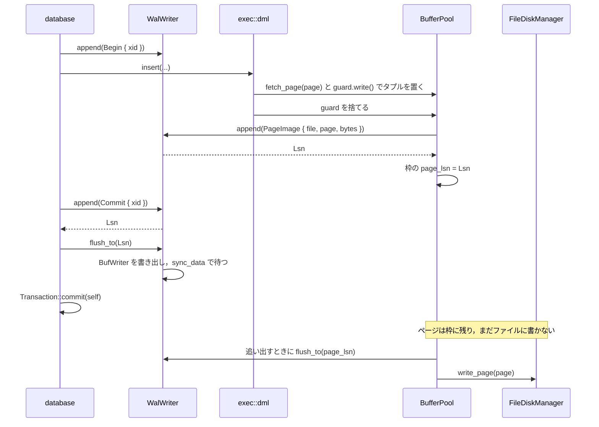
```mermaid
sequenceDiagram
  participant database
  participant wal as WalWriter
  participant dml as exec::dml
  participant pool as BufferPool
  participant disk as FileDiskManager
  database->>wal: append(Begin { xid })
  database->>dml: insert(...)
  dml->>pool: fetch_page(page) と guard.write() でタプルを置く
  dml->>pool: guard を捨てる
  pool->>wal: append(PageImage { file, page, bytes })
  wal-->>pool: Lsn
  pool->>pool: 枠の page_lsn = Lsn
  database->>wal: append(Commit { xid })
  wal-->>database: Lsn
  database->>wal: flush_to(Lsn)
  wal->>wal: BufWriter を書き出し，sync_data で待つ
  database->>database: Transaction::commit(self)
  note over pool,disk: ページは枠に残り，まだファイルに書かない
  pool->>wal: 追い出すときに flush_to(page_lsn)
  pool->>disk: write_page(page)
```

- コミットを返すのは，`Commit`のレコードがディスクに届いてからである．ページはまだファイルになくてもよい．
- ページをファイルへ書く前に，そのページの`PageImage`がディスクに届いていることを`flush_to(page_lsn)`で確かめる(WALの規則)．

## リカバリ

プロセスが止まったあと，`Database::open`でデータディレクトリを開く流れを示す．

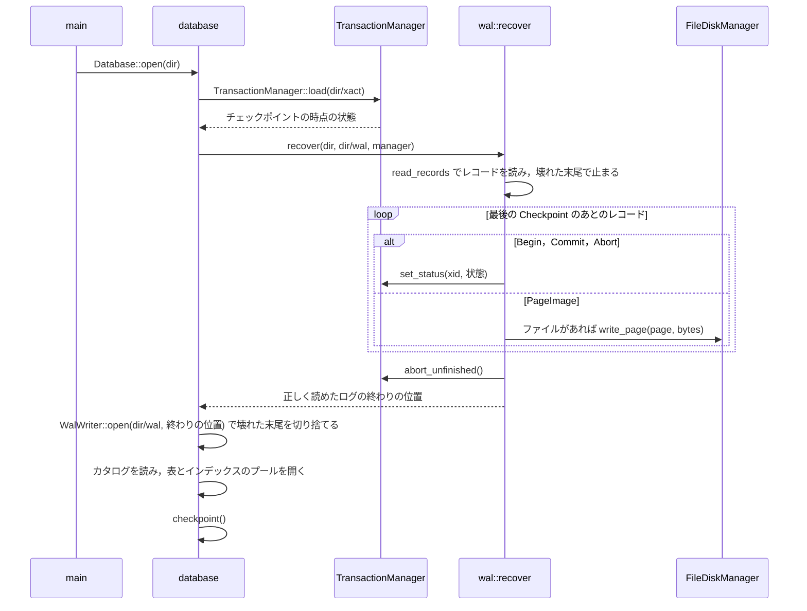
```mermaid
sequenceDiagram
  participant main
  participant database
  participant manager as TransactionManager
  participant wal as wal::recover
  participant disk as FileDiskManager
  main->>database: Database::open(dir)
  database->>manager: TransactionManager::load(dir/xact)
  manager-->>database: チェックポイントの時点の状態
  database->>wal: recover(dir, dir/wal, manager)
  wal->>wal: read_records でレコードを読み，壊れた末尾で止まる
  loop 最後の Checkpoint のあとのレコード
    alt Begin，Commit，Abort
      wal->>manager: set_status(xid, 状態)
    else PageImage
      wal->>disk: ファイルがあれば write_page(page, bytes)
    end
  end
  wal->>manager: abort_unfinished()
  wal-->>database: 正しく読めたログの終わりの位置
  database->>database: WalWriter::open(dir/wal, 終わりの位置) で壊れた末尾を切り捨てる
  database->>database: カタログを読み，表とインデックスのプールを開く
  database->>database: checkpoint()
```

- `Commit`のレコードがないトランザクションは，中止したものとみなす．その版は，ページに残っていても見えない．MVCCでは，中止したトランザクションの変更を取り消す(UNDO)仕事がない．
- チェックポイントでは，変更されたページをすべてファイルに書いてディスクに届け，トランザクションの状態を`xact`に書いてから，`Checkpoint`のレコードを書く．表とインデックスを作る文と消す文のあとにも，チェックポイントを取る．

## サーバーの接続

`psql`が接続し，`SELECT * FROM t; INSERT INTO t VALUES (3)`を1つの`Query`で送って終わるまでのメッセージのやりとりを示す．

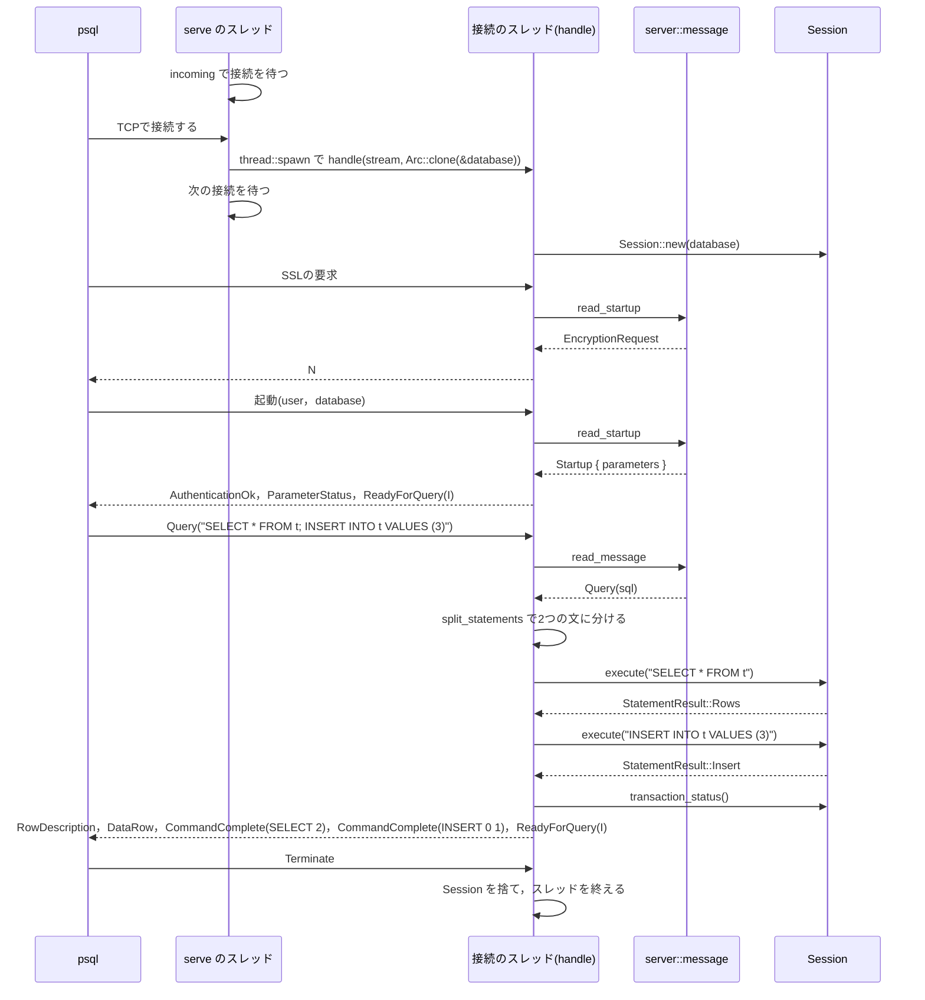
```mermaid
sequenceDiagram
  participant client as psql
  participant serve as serve のスレッド
  participant connection as 接続のスレッド(handle)
  participant message as server::message
  participant session as Session
  serve->>serve: incoming で接続を待つ
  client->>serve: TCPで接続する
  serve->>connection: thread::spawn で handle(stream, Arc::clone(&database))
  serve->>serve: 次の接続を待つ
  connection->>session: Session::new(database)
  client->>connection: SSLの要求
  connection->>message: read_startup
  message-->>connection: EncryptionRequest
  connection-->>client: N
  client->>connection: 起動(user，database)
  connection->>message: read_startup
  message-->>connection: Startup { parameters }
  connection-->>client: AuthenticationOk，ParameterStatus，ReadyForQuery(I)
  client->>connection: Query("SELECT * FROM t#59; INSERT INTO t VALUES (3)")
  connection->>message: read_message
  message-->>connection: Query(sql)
  connection->>connection: split_statements で2つの文に分ける
  connection->>session: execute("SELECT * FROM t")
  session-->>connection: StatementResult::Rows
  connection->>session: execute("INSERT INTO t VALUES (3)")
  session-->>connection: StatementResult::Insert
  connection->>session: transaction_status()
  connection-->>client: RowDescription，DataRow，CommandComplete(SELECT 2)，CommandComplete(INSERT 0 1)，ReadyForQuery(I)
  client->>connection: Terminate
  connection->>connection: Session を捨て，スレッドを終える
```

- `handle`は，1つの`Query`に返すメッセージを`Vec<u8>`に並べ，`write_all`の1回で書く．
- 文がエラーになると，`ErrorResponse`を返し，同じ`Query`の残りの文は実行しない．エラーの位置には，その文より前の文字の数を足す．
- 空の`Query`には`EmptyQueryResponse`を返す．

## 2つのセッション

セッションAがトランザクションの中で行を加え，コミットする前に，セッションBが表を読む流れを示す．
ラッチは文を実行する間だけ持つので，Bの`SELECT`はAのトランザクションが終わるのを待たない．

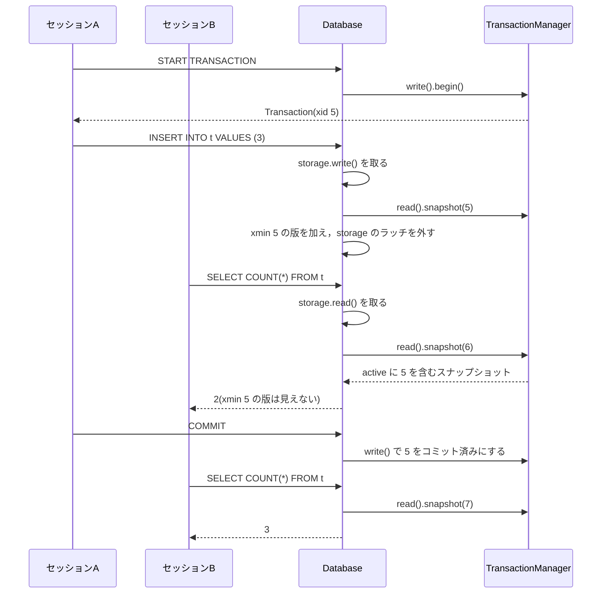
```mermaid
sequenceDiagram
  participant a as セッションA
  participant b as セッションB
  participant database as Database
  participant manager as TransactionManager
  a->>database: START TRANSACTION
  database->>manager: write().begin()
  manager-->>a: Transaction(xid 5)
  a->>database: INSERT INTO t VALUES (3)
  database->>database: storage.write() を取る
  database->>manager: read().snapshot(5)
  database->>database: xmin 5 の版を加え，storage のラッチを外す
  b->>database: SELECT COUNT(*) FROM t
  database->>database: storage.read() を取る
  database->>manager: read().snapshot(6)
  manager-->>database: active に 5 を含むスナップショット
  database-->>b: 2(xmin 5 の版は見えない)
  a->>database: COMMIT
  database->>manager: write() で 5 をコミット済みにする
  b->>database: SELECT COUNT(*) FROM t
  database->>manager: read().snapshot(7)
  database-->>b: 3
```

- 問い合わせは`storage`の読み取りのラッチを取るので，ほかのセッションの問い合わせと同時に動く．`INSERT`などの変更の文は書き込みのラッチを取るので，ほかの文が終わるのを待ってから動く．
- まだコミットしていない版を見せないのは，ラッチでなく，スナップショットによる可視性の判定(MVCC)である．

## 書き込みの競合

`REPEATABLE READ`の2つのセッションが同じ行を書き換える流れを示す．
Bは，Aが書き換えている行に出会うと，ラッチをすべて外してAの終わりを待つ．Aがコミットしたので，Bの`UPDATE`はエラーになる．

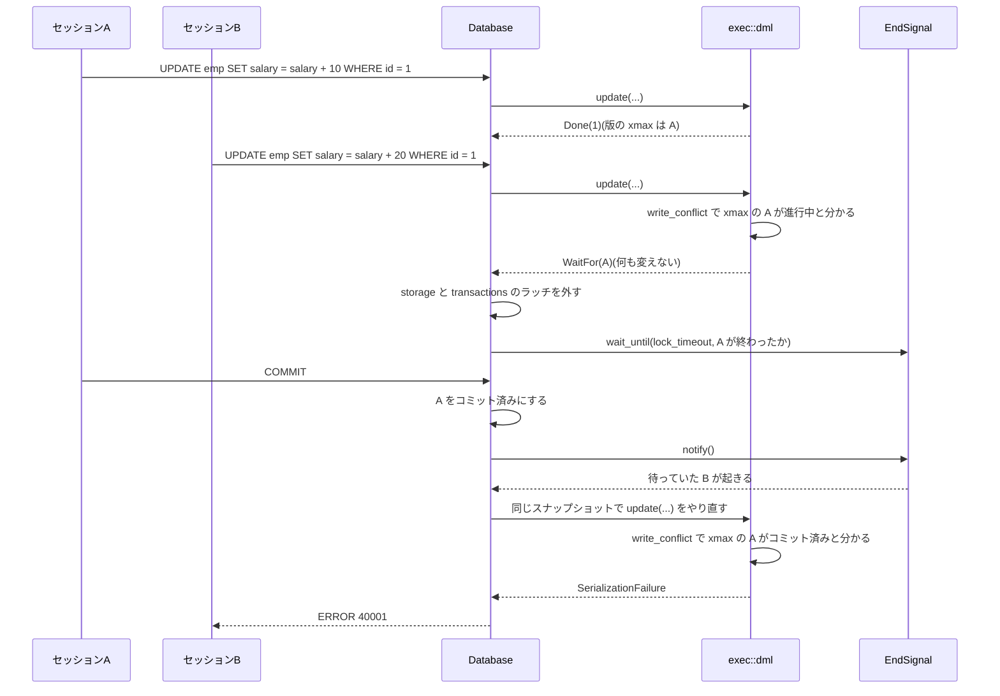
```mermaid
sequenceDiagram
  participant a as セッションA
  participant b as セッションB
  participant database as Database
  participant dml as exec::dml
  participant ends as EndSignal
  a->>database: UPDATE emp SET salary = salary + 10 WHERE id = 1
  database->>dml: update(...)
  dml-->>database: Done(1)(版の xmax は A)
  b->>database: UPDATE emp SET salary = salary + 20 WHERE id = 1
  database->>dml: update(...)
  dml->>dml: write_conflict で xmax の A が進行中と分かる
  dml-->>database: WaitFor(A)(何も変えない)
  database->>database: storage と transactions のラッチを外す
  database->>ends: wait_until(lock_timeout, A が終わったか)
  a->>database: COMMIT
  database->>database: A をコミット済みにする
  database->>ends: notify()
  ends-->>database: 待っていた B が起きる
  database->>dml: 同じスナップショットで update(...) をやり直す
  dml->>dml: write_conflict で xmax の A がコミット済みと分かる
  dml-->>database: SerializationFailure
  database-->>b: ERROR 40001
```

- `READ COMMITTED`なら，やり直すときに新しいスナップショットを作る．Aの新しい版が見え，古い版は見えないので，Bは新しい版の`WHERE`を評価し直して書き換える．
- Aが中止した場合は，古い版の`xmax`を書いていないものとみなすので，Bはどちらの分離レベルでもそのまま書き換える．
- 待つ間はラッチを持たないので，Aの`COMMIT`とほかのセッションの文は進む．
